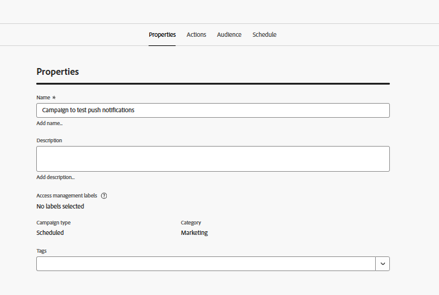

# Créer une campagne

Au cours de cette étape, vous allez créer une campagne dans Adobe Journey Optimizer pour envoyer des notifications push web planifiées aux utilisateurs qui se sont inscrits. La campagne cible une audience éligible et diffuse des messages à un moment prédéfini, ce qui permet un engagement planifié et basé sur l’audience.

* Connexion à Journey Optimizer
* Accédez à Gestion des Parcours | Campagnes | Créer des campagnes

## Spécifier les paramètres de la campagne

Spécifier le nom de la campagne

## Associer l’action à la campagne

Associez la configuration de canal push créée précédemment dans ce tutoriel

## Associer une audience à la campagne

Associer le `AudienceForPush` d’audience à la campagne

## Créer du contenu pour la notification push

Créez du contenu push de base pour tester la notification push. Indiquez le titre et le corps du message comme illustré ci-dessous

## Planifier la campagne

Planifier la campagne en fonction de vos besoins

Enfin, assurez-vous d’activer la campagne.

## Tester la campagne

Pour tester la campagne, activez d’abord les notifications sur la page web [en vous inscrivant](http://localhost:3000) lorsque vous y êtes invité. Une fois la souscription effectuée, attendez que la campagne s’exécute à l’heure planifiée. Lorsque la campagne s’exécute, vous devriez recevoir la notification push dans votre navigateur.
