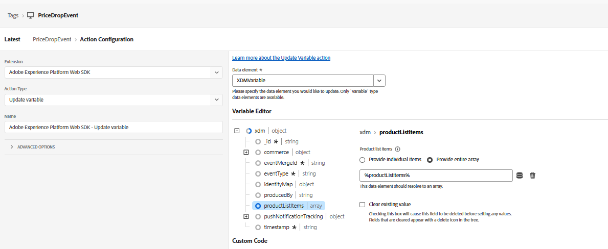

# Créer une propriété de balise

Dans la deuxième partie de ce tutoriel, vous apprendrez à déclencher des notifications push en temps réel en envoyant manuellement un événement price.drop personnalisé. Cette approche utilise la collecte de données AEP (balises) pour capturer l’événement à partir de la page web et l’envoyer à Adobe Experience Platform. Une fois l&#39;événement ingéré, il déclenche un parcours dans Adobe Journey Optimizer, ce qui vous permet d&#39;envoyer des notifications push à la demande en fonction des actions des utilisateurs ou des événements métier.

Cette propriété est configurée avec AEP Web SDK, qui est connecté au `WebPushDataStream` créé précédemment dans le tutoriel. La propriété de balise écoute l’événement `price.drop` sur la couche de données Adobe et mappe les détails du produit pertinents en mettant à jour l’élément de données ProductListItems. Une fois les données préparées, une règle dans la propriété de balise se déclenche et envoie l’événement price.drop à AEP via le SDK Web. Cet événement sert ensuite de point d’entrée pour un parcours dans Adobe Journey Optimizer, ce qui permet la diffusion immédiate de notifications push en fonction de la baisse du prix.

## Éléments de balise

ProductListItems pour contenir les détails du produit


mappage de xdmvariable à la `schemaForPushNotification`


## Créer une règle

Écouter l’événement price.drop


Mettez à jour productListItems à l’aide de la variable de mise à jour

Enfin, envoyez l’événement price.drop à AEP avec la variable xdm mise à jour


Le code javascript suivant envoie l’événement price.drop aux balises AEP à partir de la page web

```javascript
 <script>
      window.adobeDataLayer.push({
        event: "price.drop",
        productListItems: productListItems
      });
  </script>
```


