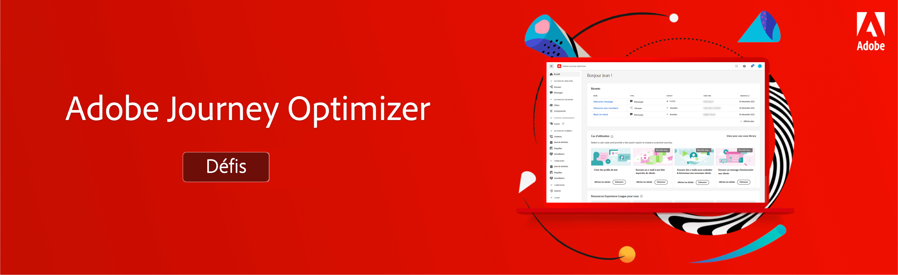

# Défis Journey Optimizer - Introduction et conditions préalables

Les défis fournissent un scénario et les exigences nécessaires pour pratiquer ce que vous avez appris. Les défis vous aident à évaluer votre niveau de compétence et à identifier les écarts de connaissances.

Chaque défi de cette section répond à un cas d’utilisation unique que vous allez implémenter. Le public cible (personnage) et les compétences requises sont répertoriés au début de chaque défi.

## Conditions préalables

### Configuration requise

* Accès à un environnement de test Journey Optimizer : nous vous recommandons de relever le défi dans un environnement de test de formation dédié.
* AEM Assets Essentials doit être configuré pour votre instance.
* Le canal email doit être configuré pour les messages transactionnels et marketing.

### Droits d’accès

Vous avez besoin des droits d’accès suivants :
* *Gestionnaire de parcours* ou *Administrateur de parcours*
* Affichage des profils de test et de leurs attributs

>[!NOTE]
> Les exercices ont été développés à partir des données d’exemple de Luma. Il est recommandé de configurer un environnement de test d’entraînement configuré avec les données d’exemple. Consultez le tutoriel [Configuration d’un environnement de test de formation](/help/tutorial-configure-a-training-sandbox/introduction-and-prerequisites.md) pour obtenir des instructions détaillées.

### Actions requises

* Si vous découvrez Adobe Journey Optimizer, suivez le cours. [Prise en main de Journey Optimizer pour les responsables et les administrateurs de Parcours](https://experienceleague.adobe.com/?recommended=JourneyOptimizer-U-1-2021.1&amp;lang=fr).

## L&#39;histoire

Luma est une société de vêtements de fiction et d’athlétisme, qui possède des magasins dans plusieurs pays, une présence en ligne avec un site web et des applications mobiles. Luma utilise Adobe Journey Optimizer pour offrir des expériences connectées, contextuelles et personnalisées à ses clients.

Luma cherche à promouvoir ses vêtements et sa collection d’articles les plus récents et à stimuler les ventes pour les clients existants. Vous avez été engagé pour mettre en oeuvre les campagnes de marketing et de rétention Luma dans Journey Optimizer.

## Vos défis

<table>
<tr>
<td>
 

      
      

  </td>
  <td>
   <a href="summer-collection-announcement-challenge.md">
    <strong>Créer une annonce de collection d’été </strong>
    </a>
      

      <em>Convertissez la nouvelle collection d’été Luma. </em>
      

      <b>Compétences requises :</b>
      <li><a href="https://experienceleague.adobe.com/docs/journey-optimizer-learn/tutorials/profiles-segments-subscriptions/create-segments.html"> Créer des segments</li>
      <li><a href="https://experienceleague.adobe.com/docs/journey-optimizer-learn/tutorials/create-messages/create-emails/import-and-author-html-email-content.html">Importation et création de contenu d’e-mail HTML</li>
      <li><a href="https://experienceleague.adobe.com/docs/journey-optimizer-learn/tutorials/create-journeys/use-case-read-segment.html">Cas d’utilisation : lecture de segment</li>
  </td>
  </tr>
  <tr>
  <td>
  

    
  </td>
  <td>
      <a href="order-confirmation-challenge.md">
    <strong>Créer une confirmation de commande</strong>
    </a>
    

    

    <em>Envoyer un email de confirmation de commande lorsqu’une personne effectue un achat en ligne
    </em>
    

  </td>
  </tr>
  <tr>
    <td>
    

    
    

    <td>
    

      <a href="product-replenishment-challenge.md">
    <strong>Créer une notification de réapprovisionnement de produit </strong>
    </a>
    

    

    <em>Notifier les clients lorsqu’un article précédemment en rupture de stock est de nouveau en stock</em>
    

  </td>
  </tr>
  <tr>
    <td>
    

    
    

    <td>
    

      <a href="loyalty-status-welcome-email-challenge.md">
    <strong>Créer un email de bienvenue relatif à l’état de fidélité </strong>
    </a>
    

    

    <em>Envoyer un email lorsqu’un client fidèle passe à un nouveau niveau pour le féliciter et l’informer de ses nouveaux avantages</em>
    

  </td>
  </tr>
</table>
