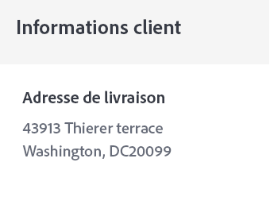

# Créer un email de confirmation de commande


| Défi | Créer un email transactionnel de confirmation de commande |
|---|---|
| Personne | Gestionnaire de parcours |
| Compétences requises | <ul><li>[Création d’un contenu d’e-mail avec l’éditeur de messages](https://experienceleague.adobe.com/docs/journey-optimizer-learn/tutorials/create-messages/create-email-content-with-the-message-editor.html?lang=en)</li> <li>[Utilisation d’informations d’événement contextuelles pour la personnalisation](https://experienceleague.adobe.com/docs/journey-optimizer-learn/tutorials/personalize-content/use-contextual-event-information-for-personalization.html?lang=en)</li><li>[Utilisation des fonctions helper pour la personnalisation](https://experienceleague.adobe.com/docs/journey-optimizer-learn/tutorials/personalize-content/use-helper-functions-for-personalization.html?lang=en)</li></ul> |
| Ressources à télécharger | [Ressources de confirmation de commande](/help/challenges/assets/email-assets/order-confirmation-assets.zip) |

## L&#39;histoire

Luma lance sa boutique en ligne et souhaite garantir une bonne expérience client en proposant un email de confirmation de commande une fois qu’un client a passé une commande.


## Votre défi

Créez un parcours qui envoie un courrier électronique de confirmation de commande lorsqu’un client Luma termine une commande en ligne.

>[!BEGINTABS]

>[!TAB Tâche]

1. Créez un parcours appelé `Luma - Order Confirmation`
1. Utilisez l’événement : [!DNL LumaOnlinePurchase] comme déclencheur
1. Créez l’e-mail de confirmation de commande appelé `Luma - Order Confirmation`

* Transactionnel de catégorie : veillez à sélectionner la surface de l’email transactionnel.
* L’objet doit être personnalisé avec le prénom du destinataire et doit inclure l’expression &quot;Merci pour votre achat&quot;.
* Utilisez la variable **Luma - Synthèse de la commande** et modifiez-le :

En suivant les directives de la marque Luma, l’email doit être structuré comme suit :
<table>
<tr>
<td>
  <div>
     <strong> Section d’en-tête</strong>
      </div>
  </td>
  <td>
    <strong>Logo Luma</strong>
      <p>
     <li>luma_logo.png</li>
    <li>Taille 35 %, arrière-plan blanc centré </li>
    <li>Il doit comporter un lien vers le site web luma : https://publish1034.adobedemo.com/content/luma/us/en.html</li>
    <p>
    </td>
  </tr>
  <tr>
  <td>
  <div>
    <strong>Section de confirmation de commande
    </strong>
  </td>
  <td>
    <strong>Image</strong><p>
    <li>luma-transactional-order-confirmation-2.jpg </li>
    <li>Marge : Haut, bas (10)<div>
    <p>
    <strong>Texte</strong><p>
    <em>Hey {prénom}</em><p>
    <li>Alignement : left  </li>
   <li>Couleur du texte : rgb(69, 97, 162) #4461a2; 
   <li>font-size: 20 px</li>
   <div>
    <p>
     <em>Votre commande a été passée.
    <p>Une fois votre package livré, nous vous enverrons un email avec un numéro de tracking afin que vous puissiez tracker votre commande.</p></em>
    </strong>
    </tr>
  </td>
 <td>
  <div>
     <strong> Section Ship</strong>
      </div>
      <p><li>Remplacez l’adresse codée en dur dans le modèle par la payload de l’adresse du profil.
      <li> Supprimer la remise, totale, arrivée</p>
  </td>
  <td>
  <p> Ship to :</p>
      <em>Prénom Nom<br>
      Rue<br>
      Ville, État, code postal</em></p>

    &lt;strong>Bouton :&lt;/strong>&lt;/p>
<p><em>Afficher l’ordre</em></p>
      <li>Couleur d’arrière-plan : rgb(25, 121, 195)</li>
      <li>Couleur du texte : Blanc</li>
      <li>Aucune bordure</li>
      <li>Hauteur : 40</li>
      <li>Ajouter un lien vers un site web de votre choix </li>
      <li>Aligne le texte à gauche au-dessus (Conseil : utiliser la marge du conteneur)</li>
  </td>
 <tr>
<td>
  <div>
     <strong>Section Détails de la commande</strong>
      </div>
       <p><li>Ajoutez cette section entre les <b>Ship to</b> et le <b>Afficher la commande</b> button
      </p><br>
      <p><b>Astuces:</b>
      <li>Il s’agit d’informations d’événement contextuelles.
      <li>Utilisez la fonction d’assistance !UICONTROL] : [!UICONTROL Chacune]
      <li>Passez au format de l’éditeur de code pour ajouter les données contextuelles.
      <li>Placez les informations dans des conteneurs à l’aide de balises DIV.
  </td>
  <td>
    <strong>En-tête</strong>
    <p>
    <em>Commande {Purchase Order Number}</em>
    </p>
    <strong>Liste des produits commandés :
  </strong>
  <p>Chacun des éléments doit être formaté comme suit :
    
</p>
<strong>Image du produit :</strong>
<li>Classe : cart-item-chair
<li>style : border-box: min-height:40 px</li>
<li>marge intérieure supérieure et inférieure : 20 px</li>
<li>remplissage-gauche:80px</li>
<li>border-radius:0px</li>
<li>Utiliser comme image d’arrière-plan pour le conteneur</li>
<li>background-position: 0 % 50 %</li>
<li>background-size: 60 px</li>
<li>background-repeat : no-repeat</li>
<p>
<strong>Prix:</strong>
<li>Format = H5</li>
<li>style = taille de boîte:bordure-box</li>
<li>margin-bottom:5px</li>
<li>margintop:0px;</li>
<p>
<strong>Nom et quantité :</strong>
<li>class=text-small</li>
<li>style=taille des cases : border-box</li>
<li>padding-top : 5px</li>
<li>color: rgb(101, 106, 119)</li>
<li>font-size:14px</li>
<p>
</td>
  </tr>
</table>


>[!TIP]
>
>Pour vous permettre de résoudre les problèmes de vos parcours, il est recommandé d’ajouter un autre chemin à toutes les actions de message en cas d’expiration ou d’erreur.

>[!TAB Critères de réussite]

Déclenchez le Parcours que vous avez créé en mode test et envoyez-le vous-même :

1. Afficher les valeurs masquées en cliquant sur le symbole de l’oeil :
   1. Dans les paramètres de l’e-mail, cliquez sur le symbole T (activer le remplacement des paramètres).
      
   2. Cliquez dans le champ Adresse
   3. Dans l’écran suivant, ajoutez votre adresse électronique entre parenthèses : *yourname@yourdomain* dans l’éditeur d’expression, puis cliquez sur ok.
2. Mise du parcours en mode test
3. Déclenchez l’événement avec les paramètres suivants :
   * Définissez l’identifiant de profil sur : Jenna_Palmer9530@emailsim.io
   * Type d’événement : commerce.purchases
   * Nom : Sprite Yoga Companion Kit
   * Quantité : 1
   * Total du prix : 61
   * Numéro de commande : 6253728
   * SKU : 24-WG080
   * productImageURL : <https://publish1034.adobedemo.com/content/dam/luma/en/products/gear/fitness-equipment/luma-yoga-kit-2.jpg>

Vous devriez recevoir l’e-mail de confirmation d’achat personnalisé, avec le produit spécifié.

* La ligne d’objet doit commencer par le prénom de votre profil de test : Jenna
* La section Détails de la commande doit être renseignée avec les détails de la commande que vous avez saisis lors du test.
* Les informations sur les clients doivent comporter le code de ville et postal de votre profil de test :

   43913 Thierer Terrace, Washington DC 2009


>[!TAB Vérifier votre travail]

** Parcours


** E-mail

**Objet:**

{{ profile.person.name.firstName }}, merci pour votre achat !


**Section Détails de la commande :**


Voici à quoi votre code doit ressembler :

Header:

```javascript
Order: {{context.journey.events.1627840522.commerce.order.purchaseOrderNumber}}
```

Liste des produits :

Utilisez la fonction d’assistance &quot;each&quot; pour créer la liste des produits. Voici à quoi votre code doit ressembler :

```javascript
{{#each context.journey.events.1911672547.productListItems as|product|}}
<div class="cart-item-chair" style="box-sizing:border-box;min-height:40px;padding-top:20px;padding-bottom:20px;padding-left:80px;border-radius:0px;background-image:url({{product._wwfovlab065.productImageURL}});background-position:0% 50%;background-size:60px;background-repeat:no-repeat;">
<h5 style="box-sizing:border-box;margin-bottom:5px;font-size:16px;line-height:20px;margin-top:0px;">${{product.priceTotal}}.00</h5>
<div class="text-small" style="box-sizing:border-box;padding-top:5px;color:rgb(101, 106, 119);font-size:14px;">{{product.name}}</div><div class="text-small" style="box-sizing:border-box;padding-top:5px;color:rgb(101, 106, 119);font-size:14px;">Quantity: {{product.quantity}}</div></div><div class="divider-small" style="box-sizing:border-box;height:1px;margin-top:10px;margin-bottom:10px;background-color:rgb(209, 213, 223);"> </div>
{{/each}}

Total: ${{context.journey.events.1627840522.commerce.order.priceTotal}} 
```

**Section Informations client**



La personnalisation doit se présenter comme suit :

```javascript
{{profile.homeAddress.street1}}
{{profile.homeAddress.city}},{{profile.homeAddress.state}} {{profile.homeAddress.postalCode}}
```

>[!ENDTABS]