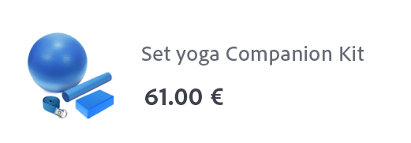

# Créer un e-mail de confirmation de commande


| Défi | Créer un e-mail transactionnel de confirmation de commande |
|---|---|
| Utilisateurs | Gestionnaire de parcours |
| Compétences requises | <ul><li>[Créer un contenu d’e-mail avec l’éditeur de messages](https://experienceleague.adobe.com/docs/journey-optimizer-learn/tutorials/create-messages/create-email-content-with-the-message-editor.html?lang=fr)</li> <li>[Utiliser des informations d’événement contextuelles pour la personnalisation](https://experienceleague.adobe.com/docs/journey-optimizer-learn/tutorials/personalize-content/use-contextual-event-information-for-personalization.html?lang=fr)</li><li>[Utiliser des fonctions d’assistance pour la personnalisation](https://experienceleague.adobe.com/docs/journey-optimizer-learn/tutorials/personalize-content/use-helper-functions-for-personalization.html?lang=fr)</li></ul> |
| Ressources à télécharger | [Ressources de confirmation de commande](/help/challenges/assets/email-assets/order-confirmation-assets.zip) |

## L’histoire

Luma lance sa boutique en ligne et souhaite garantir une bonne expérience client en proposant un e-mail de confirmation de commande une fois qu’un(e) client(e) a passé une commande.


## Votre défi

Créez un parcours qui envoie un e-mail de confirmation de commande lorsqu’un(e) client(e) Luma termine une commande en ligne.

>[!BEGINTABS]

>[!TAB Tâche]

1. Créez un parcours appelé `Luma - Order Confirmation`.
2. Utilisez l’événement : `LumaOnlinePurchase`
3. Créez un **transactionnel**  email appelé `Luma - Order Confirmation`

* L’objet &quot;Merci pour votre achat, `FirstName`&quot;
* Utilisez le modèle `Luma - Order summary` et modifiez-le :
   * Supprimez le `You may also like` sections
   * Ajouter le lien de désabonnement au bas de l&#39;email

L’e-mail doit être structuré comme suit :
<table>
<tr>
<td>
  <div>
     <strong>Section d’en-tête</strong>
      </div>
  </td>
  <td>
      <p>
     <li>luma_logo.png</li>
    <li>Il doit renvoyer au site web luma : https://luma.enablementadobe.com/content/luma/us/en.html</li>
    <p>
    </td>
  </tr>
  <tr>
  <td>
  <div>
    <strong>Section de confirmation de commande</strong>
  </td>
  <td>
    <p>
    <strong>Texte</strong><p>
    <em>Hey {firstName},</em><p>
   <div>
    <p>
     <em>Votre commande a été passée.
    <p>Une fois votre paquet envoyé, nous vous enverrons un e-mail avec un numéro de suivi afin que vous puissiez suivre votre commande.</p></em>
    </strong>
    </tr>
  </td>
 <td>
  <div>
     <strong>Section Adresse de livraison</strong>
      </div>
      <p>
      <li>Le prénom et le nom proviennent du profil.
      <li>Remplacez l’adresse codée en dur dans le modèle par le <b>adresse de livraison</b>
      <li>Les détails de l’adresse sont des attributs contextuels de l’événement (rue 1, ville, code postal, état).
      <li> Supprimer <i>Remise, Total, Arrivée</i></p>
  </td>
  <td>
  <p> Adresse de livraison :</p>
      <em>{firstName} {lastName}<br>
     {Rue 1}<br>
     {City}, {State} {postalCode}<br></em></p>
  </td>
 <tr>
<td>
  <div>
     <strong>Section Détails de la commande</strong>
      </div>
       <p><li>Ajoutez cette section sous la section <b>Ship to</b> .
      </p><br>
      <p><b>Astuces :</b>
      <li>Utilisation du composant de structure <b>Colonne 1:2 à gauche</b> pour cette section
      <li>Il s’agit d’informations d’événement contextuelles.
      <li>Utilisez la fonction [!UICONTROL helper function]: [!UICONTROL Each].
      <li>Passez au format de l’éditeur de code pour ajouter les données contextuelles.
  </td>
  <td>
    <strong>En-tête</strong>
    <p>
  Ordre : <em>{purchaseOrderNumber}</em>
    </p>
    <strong>Liste des produits commandés :
</strong>
  <p>Listez chaque produit dans la commande avec une image, le prix et le nom.
  <p>La mise en page de chaque élément doit se présenter comme suit :
    
<p><b>Ajouter le lien vers le panier</b>
<p>Remplacez l’identifiant de commande dans l’URL par le numéro de bon de commande :
   <i>https://luma.enablementadobe.com/content/luma/us/en/user/account/order-history/order-details.html?orderId=90845952-c2ea-4872-8466-5289183e4607</i>
</td>
  </tr>
</table>


>[!TIP]
>
>Pour vous permettre de résoudre les problèmes de vos parcours, il est recommandé d’ajouter un autre chemin d’accès à toutes les actions de message en cas d’expiration ou d’erreur.

>[!TAB Critères de réussite]

Déclenchez le parcours que vous avez créé en mode test et envoyez l’e-mail à vous-même :

1. Avant de passer en mode test, remplacez les paramètres de courrier électronique à envoyer au test de l’adresse électronique :
   1. Ouvrez la vue Détails de l&#39;email.
   2. Dans les paramètres de l’e-mail, cliquez sur le symbole T (activez le remplacement des paramètres).
   3. Cliquez dans le champ Adresse.
   4. Dans l’écran suivant, ajoutez votre adresse électronique entre parenthèses : *&quot;yourname@yourdomain&quot;* dans l’éditeur d’expression, puis cliquez sur ok.
2. Mettez le parcours en mode test.
3. Déclenchez l’événement avec les paramètres suivants :
   * Définissez l’identifiant de profil sur : valeur d’identité :`a8f14eab3b483c2b96171b575ecd90b1`
   * Type d’événement : commerce.purchases
   * `Quantity`: 1
   * `Price Total:` 69
   * `Purchase Order Number:` 90845952-c2ea-4872-8466-5289183e4607
   * `SKU:` LLMH09
   * `City:`San José
   * `Postal Code:` 95119
   * `State` : Californie
   * `Street:` 245 Park Avenue

Vous devriez recevoir l’email de confirmation d’achat personnalisé.

* L’objet doit porter le prénom du profil de test : Leora.

* Voici à quoi votre corps d’email doit ressembler :


>[!TAB Vérifier votre travail]

**Parcours**


**E-mail**

**Objet :**

Merci pour votre achat, {{ profile.person.name.firstName }}!

**Section Adresse de livraison :**

Voici à quoi votre code doit ressembler :

```javascript
{{ profile.person.name.firstName }} {{ profile.person.name.lastName }}
{{context.journey.events.454181416.commerce.shipping.address.street1}}
{{context.journey.events.454181416.commerce.shipping.address.city}}, {{context.journey.events.454181416.commerce.shipping.address.state}} {{context.journey.events.454181416.commerce.shipping.address.postalCode}}
```

*event.45481416* sera un nombre différent pour vous.

CONSEIL : personnalisez chaque ligne séparément.

**Section Détails de la commande :**

Voici à quoi votre code doit ressembler :

En-tête :

```javascript
Order #: {{context.journey.events.1627840522.commerce.order.purchaseOrderNumber}}
```

**Liste des produits :**

Utilisez la fonction d’assistance « each » pour créer la liste des produits. Affichez-les dans un tableau. Voici à quoi votre code doit ressembler (avec vos variables spécifiques, telles que votre ID d’événement, au lieu de `454181416` et votre organisation I au lieu de `techmarketingdemos` ) :

```javascript
{{#each context.journey.events.454181416.productListItems as |product|}}<tr> <th class="colspan33"><div class="acr-fragment acr-component image-container" data-component-id="image" style="width:100%;text-align:center;" contenteditable="false"><!--[if mso]><table cellpadding="0" cellspacing="0" border="0" width="100%"><tr><td style="text-align: center;" ><![endif]--><!--[if mso]></td></tr></table><![endif]--></div></th> <th class="colspan66"><div class="acr-fragment acr-component" data-component-id="text" contenteditable="false"><div class="text-container" contenteditable="true"><p><span style="font-weight:700;">{{context.journey.events.454181416.productListItems.VYG__902489191a0a40e67f51f17f3ea9e2dfaf2dea3bd0bebe8b._techmarketingdemos.product.name}}</span></p></div></div><div class="acr-fragment acr-component" data-component-id="text" contenteditable="false"><div class="text-container" contenteditable="true"><p>${{context.journey.events.454181416.productListItems.VYG__902489191a0a40e67f51f17f3ea9e2dfaf2dea3bd0bebe8b._techmarketingdemos.product.price}}.00</p></div></div></th></tr> {{/each}}
```

**Bouton Afficher la commande :**

`https://luma.enablementadobe.com/content/luma/us/en/user/account/order-history/order-details.html?orderId={{context.journey.events.454181416.commerce.order.purchaseOrderNumber}}`

**Prix total :**

Total :`${{context.journey.events.1627840522.commerce.order.priceTotal}}.00`


>[!ENDTABS]