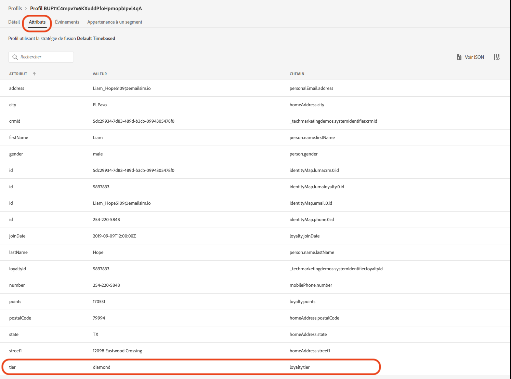
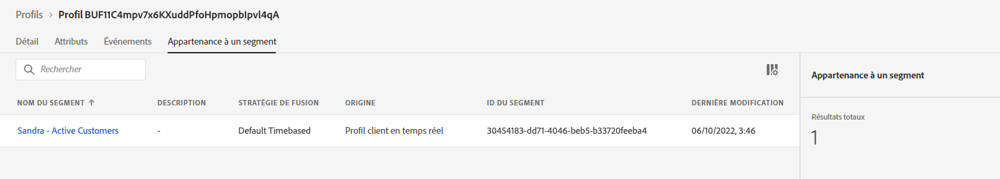

# Créer une annonce de collection d’été - défi


| Défi | Créer une annonce de collection d’été |
|---|---|
| Utilisateurs | Gestionnaire de parcours |
| Compétences requises | <ul><li>[Créer des segments](https://experienceleague.adobe.com/docs/journey-optimizer-learn/tutorials/profiles-segments-subscriptions/create-segments.html?lang=fr)</li><li> [Importer et créer du contenu d’e-mail HTML](https://experienceleague.adobe.com/docs/journey-optimizer-learn/tutorials/create-messages/create-emails/import-and-author-html-email-content.html?lang=fr)</li><li>[Cas d’utilisation : lecture de segment](https://experienceleague.adobe.com/docs/journey-optimizer-learn/tutorials/create-journeys/use-case-read-segment.html?lang=fr)</li> |
| Ressources à télécharger | [Fichiers d’e-mail de collection saisonnière](/help/challenges/assets/email-assets/emails-seasonal-collection-announcement.zip) |

{style="table-layout:auto"}

## L’histoire

Luma, une société fictive de vêtements pour les sportifs, fait la promotion de sa dernière collection de vêtements et d’équipements et encourage les ventes pour les client(e)s existant(e)s. Luma lance la nouvelle collection d’été et souhaite en particulier cibler différents segments de client(e)s.

## Votre défi

L’équipe marketing de Luma vous demande de mettre en œuvre une campagne marketing de collection d’été dans Journey Optimizer. Votre défi est de :

* Créer un segment définissant les profils qui peuvent recevoir la promotion.
* Créer le parcours.

### Étape 1 : définir le segment - clients et clientes actifs

>[!BEGINTABS]

>[!TAB Tâche]

#### Créer un segment dans [!DNL Journey Optimizer]

* Créez un segment dans [!DNL Journey Optimizer] appelé *Clients et clientes actifs*.
* Le segment ne doit inclure que les clients et clientes actifs de Luma.
* Les clients et clientes actifs sont définis comme des client(e)s ayant un niveau dans le programme de fidélité de Luma (bronze, argent, or ou platine).


>[!TAB Critères de réussite]

Dans le créateur de segments, vous pouvez consulter l’estimation du nombre de profils qualifiés. Si vous travaillez avec les données du sandbox de formation, vous disposez d’environ 753 profils qualifiés sur 1 290.

>[!NOTE]
>L’affichage de l’appartenance au segment pour les profils existants peut prendre jusqu’à 24 heures, car les profils existants doivent être renvoyés.

**Un profil qualifié a été ajouté au segment :**

Vous pouvez vérifier les profils qui ont été ajoutés au segment en accédant à l’un des profils répertoriés dans la vue détaillée de votre segment.

Sur la page du profil, vérifiez l‘onglet [!UICONTROL Attributs] pour confirmer qu’ils remplissent les critères suivants : le niveau doit être argent, or, platine ou diamant.



Vous pouvez également vérifier l’onglet [!UICONTROL Appartenance à un segment] : votre segment doit être répertorié.



>[!TAB Vérifier votre travail]

Champs de segment : **[!UICONTROL Attributs]** > **[!UICONTROL Profil individuel XDM]** > **[!UICONTROL Fidélité]** > **[!UICONTROL Niveau]**.

Voici à quoi votre segment doit ressembler :


Le code doit se présenter comme suit :

```javascript
stringCompare("equals", loyalty.tier, ["diamond", "gold", "platinum", "silver"], false)
```

>[!ENDTABS]


### Étape 2 : créer le parcours - annonce de la collection d’été

>[!BEGINTABS]

>[!TAB Tâche]

#### Envoyer l’annonce de la collection d’été

Une agence vous a fourni quatre fichiers HTML avec la conception des emails :

* `SeasonalCollectionEmail.html`
* E-mail de collection pour hommes de Luma
* E-mail de collection pour femmes de Luma
* E-mail de 20 % de réduction sur la collection de Luma

1. [Télécharger les fichiers d’e-mail de la collection saisonnière](/help/challenges/assets/email-assets/emails-seasonal-collection-announcement.zip).

1. Créez un parcours appelé *Luma - Annonce de la collection d’été* selon les directives suivantes :

   1. Envoyez l’e-mail *Luma - annonce de la nouvelle collection d’été* au segment *Clients et clientes actifs*, en retenant 10 % de l’audience pour constituer la population témoin.
      * Titre du message *Luma - annonce de collection d’été*.
      * Objet *(prénom du ou de la destinataire), la nouvelle collection d’été Luma est arrivée !*
      * Utilisez le fichier HTML `SeasonalCollectionEmail.html` fourni pour le corps de l’e-mail.
   1. Patientez deux jours, puis envoyez un e-mail de suivi avec du contenu plus ciblé :
      * Les clients hommes doivent recevoir l’e-mail **Collection pour hommes de Luma**.
         * Titre du message : *Collection pour hommes de Luma*.
         * Objet : *(prénom du destinataire), découvrez les nouveaux équipements de sport masculins !*
         * Corps de l’e-mail : `MensCollectionEmail.html` pour le corps de l’e-mail.
      * Les clientes doivent recevoir l’e-mail **Collection pour femmes de Luma**.
         * Titre du message : *Collection pour femmes de Luma*.
         * Objet : *(prénom de la destinataire), explorez la collection pour femmes de Luma !*
         * Corps de l’e-mail : `WomensCollectionEmail.html`.
      * Les autres client(e)s doivent recevoir l’e-mail **20 % de réduction sur la collection de Luma**.
      * Titre du message : *20 % de réduction sur la collection de Luma*.
      * Objet : *(prénom du ou de la destinataire), profitez de 20 % de réduction !*
      * Corps de l’e-mail : `20OOffCollectionEmail.html`.
   1. Après avoir envoyé les e-mails ciblés ci-dessus, patientez deux jours pour l’ouverture l’e-mail.
   1. Si l’e-mail ciblé n’est pas ouvert dans les 2 jours, envoyez l’e-mail **20 % de réduction sur la collection de Luma** comme tentative de reciblage finale.


>[!TAB Critères de réussite]

#### Prévisualiser les e-mails

**E-mail n° 1 - Annonce de la collection d’été de Luma**

Prévisualisez l’e-mail :

1. Ajoutez un profil de test : Louise Petti :
   * Espace de noms d’identité : *identifiant CRM de Luma*.
   * Valeur d’identité : *d1f132f9f9502bba047a6ec86c4b61f9*.

Résultat :

* L’objet doit être le suivant : Louise, la nouvelle collection de Luma est arrivée !

**E-mail n° 2 - Collection pour hommes de Luma**

Envoyez-vous un BAT :

1. Ajoutez un profil de test : Stanleigh Stooke :
   * Espace de noms d’identité : *Identifiant CRM de Luma*.
   * Valeur de l’identité : `4f34057d9d9e792c28ba18ecae378e98`
2. Sélectionnez le profil de test : Stanleigh Stooke.
3. Envoyez-vous un BAT.

Résultat :\
Vous devriez recevoir un e-mail. L’objet doit être le suivant : *Stanleigh, découvrez les nouveaux équipements de sport masculins !* et le corps de l’email doit correspondre à ce que vous avez vu dans l’aperçu.

>[!NOTE]
>Cela peut prendre quelques minutes pour que vous receviez le BAT.

**E-mail n° 3 - Collection pour femmes de Luma**

Prévisualiser l’e-mail avec le profil de test *Louise Petti.*

* L’objet doit être le suivant : *Louise, découvrez la collection pour femmes de Luma !*

**E-mail n° 4 - 20 % de réduction sur la collection de Luma**

Prévisualisez l’e-mail avec le profil de test *Louise Petti.*

* L’objet doit être le suivant : *Louise, profitez de 20 % de réduction !*

#### Tester votre parcours

>[!IMPORTANT]
>
>Avant de mettre le parcours en mode test :
>
>1. Assurez-vous que l’[!UICONTROL activité Lecture de segment] contient l’espace de noms défini sur **l’identifiant CRM de Luma (lumaCrmId)**.
>1. Pour chaque e-mail, remplacez les paramètres d’e-mail par défaut des e-mails afin qu’ils soient envoyés à votre adresse e-mail :
   >    * Affichez les valeurs masquées en cliquant sur le symbole de l’œil.
   >    * Dans les paramètres de l’e-mail, cliquez sur le symbole T (activer le remplacement des paramètres).

      >
      >      
   > 
   >    * Cliquez dans le champ [!UICONTROL Adresse].
   >    * Dans l’écran suivant, ajoutez votre adresse e-mail entre parenthèses : `"yourname@yourdomain"` dans l’éditeur d’expression, puis cliquez sur OK.

>


Testez le parcours et envoyez les e-mails à votre compte :

1. Mettez le parcours en mode test.
1. Sélectionnez **[!UICONTROL Un profil unique à la fois]**.
1. Temps d’attente : définissez le retardateur sur 120 secondes (saisissez-le dans le champ).
1. Déclencher l’entrée de profil
1. Vous pouvez tester chaque branche à l’aide de l’un des *Identifiants CRM de Luma* en tant qu’identifiants de profil :
   * Femme : Leora Dietsche, valeur d’identité :`a8f14eab3b483c2b96171b575ecd90b1`.
   * Homme : Stanleigh Stooke, valeur d’identité : `4f34057d9d9e792c28ba18ecae378e98`.
   * Genre non spécifié : Louise Petti, valeur d’identité : `d1f132f9f9502bba047a6ec86c4b61f9`.

1. Après avoir déclenché l’entrée du profil, vous devriez recevoir le premier e-mail. L’en-tête doit être personnalisé en fonction du profil que vous avez choisi.
1. Le parcours doit continuer dans la branche correspondante et vous devriez recevoir l’e-mail associé (par exemple, si vous avez choisi *Jenna*, vous devriez recevoir l’e-mail *Collection pour femmes de Luma*).
1. Ouvrez le deuxième e-mail afin que le parcours se termine.
1. Vous pouvez répéter l’étape 4. - 7. pour les trois profils afin de vérifier si vos branches fonctionnent correctement.
1. Pour tester les expirations de délai, définissez le temps d’attente sur 30 secondes et déclenchez à nouveau l’entrée.
1. N’ouvrez pas les e-mails que vous recevez (ne prévisualisez pas l’e-mail (!)) et laissez le temps d’attente s’écouler.

Vous devriez recevoir les e-mails suivants :

* Luma - Annonce de la nouvelle collection saisonnière
* Selon le profil de test utilisé, vous devriez recevoir l’un des e-mails suivants :
   * Leora : collection pour femmes de Luma
   * Stanleigh : collection pour hommes de Luma
   * Louise : 20 % de réduction sur la collection de Luma
* Si vous n’avez pas ouvert le deuxième e-mail : 20 % de réduction sur la collection de Luma.

>[!TAB Vérifier votre travail]

Voici à quoi votre parcours doit ressembler :


**Condition - population témoin :**


**Condition - genre :**\


>[!ENDTABS]
