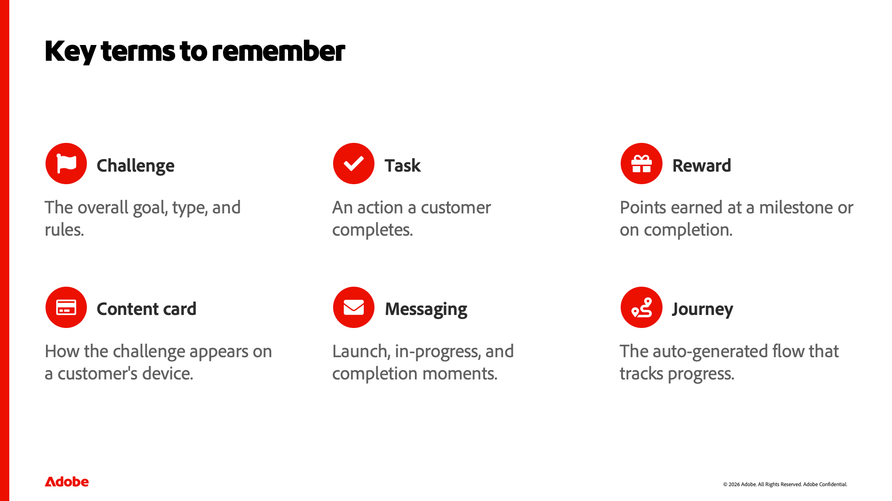

::::slides

:::intro

## Comprendre les concepts du défi de fidélité

Avant de créer quoi que ce soit dans Adobe Journey Optimizer Loyalty, il est utile de comprendre ce qu’est un défi de fidélité et les quelques éléments dont il est composé. Cette leçon construit ce vocabulaire partagé, ce qu&#39;est un défi, ses éléments de base de défi, de tâches et de récompenses, les types de défis disponibles et comment on prend vie, de sorte que les leçons pratiques qui suivent ont un sens.

:::

:::slide

### Comprendre les concepts du défi de fidélité

Bienvenue. Dans cette leçon, nous construisons un vocabulaire partagé pour Adobe Journey Optimizer Loyalty. Avant de créer quoi que ce soit, il est utile de comprendre ce qu’est réellement un défi de fidélité et les quelques éléments de base dont il est composé. C&#39;est ce que nous couvrons ici — les concepts — pour que les leçons pratiques qui suivent aient un sens.

:::

:::slide

### Qu’est-ce qu’un défi de fidélité ?

Alors, qu’est-ce qu’un défi de fidélité ? Dans sa forme la plus simple, c’est une façon de transformer votre programme de fidélité en un jeu. Vous récompensez les clients pour avoir pris des mesures spécifiques : effectuer un achat, rédiger une critique, recommander un ami, interagir sur les réseaux sociaux. Un défi fixe un objectif et les règles pour l’atteindre. Les clients progressent en exécutant les tâches, et l’accomplissement de ces tâches, ou de l’ensemble du défi, leur rapporte des récompenses. Et comme tout s’exécute sur vos données Experience Platform, la progression est suivie automatiquement, sans développement personnalisé.

:::

:::slide

### L&#39;anatomie d&#39;un défi

Chaque défi est construit à partir de trois pièces, et ce sont les trois mots sur lesquels s&#39;ancrer. Tout d’abord, le défi lui-même : l’objectif global et ses règles : le type, l’audience, le planning et la manière dont les progrès sont suivis. Deuxièmement, les tâches : les actions individuelles qu&#39;un client effectue, comme un achat ou une révision. Un défi regroupe une ou plusieurs tâches. Et troisièmement, les récompenses : ce que les clients gagnent, soit au moment où ils franchissent les jalons d’une tâche individuelle, soit lorsqu’ils relèvent l’ensemble du défi. Défi, tâches, récompenses — si vous ne vous souvenez de rien d&#39;autre, souvenez-vous de ces trois.

:::

:::slide

### Comment structurer un défi

Les défis se présentent sous plusieurs formes, selon le comportement que vous souhaitez conduire. Un défi standard permet aux clients d’effectuer un nombre illimité de tâches dans n’importe quel ordre - idéal pour plus de flexibilité. Un défi Streak leur demande de répéter la même tâche consécutivement - pensez à acheter du café sept jours d&#39;affilée. Un défi séquentiel nécessite des tâches dans un ordre défini, ce qui est idéal pour les parcours d’intégration. Et il y a un quatrième, Bring your own data, où les tâches et les récompenses proviennent de votre propre intégration de fidélité, bien que celle-ci ait une disponibilité limitée aujourd’hui.

:::

:::slide

### Défi de passer de l’idée à la vie

Voici comment ces pièces s&#39;assemblent lorsque vous en construisez une. Vous commencez par créer le défi et en choisir le type. Vous configurez ses paramètres : audience, planning et règles. Vous lui donnez une structure en ajoutant des tâches et des récompenses. Vous concevez la manière dont elle s’affichera pour les clients disposant de cartes de contenu et éventuellement configurez la messagerie pour le lancement, la progression et la fin. Enfin, vous lancez : publiez le défi et générez le parcours qui suit les progrès de chacun. Nous approfondissons chacun de ces aspects dans les leçons suivantes ; pour l&#39;instant, il suffit de remarquer la forme du flux.

:::

:::slide

### Termes clés à retenir

Enfermons le vocabulaire. L’objectif global, le type et les règles constituent un défi. Une tâche est une action effectuée par un client. Une récompense correspond à ce qu’ils gagnent, à un jalon ou à la fin de leur projet. Une carte de contenu est la manière dont le défi s’affiche sur l’appareil d’un client. Les messages couvrent les moments de lancement, de progression et d’achèvement. Et le parcours est le flux généré automatiquement qui suit la progression en coulisses. Vous verrez ces six termes tout au long du reste du cours.

C&#39;est le modèle mental. Vous savez maintenant ce qu&#39;est un défi de fidélité, les trois éléments dont il est composé, les types disponibles et comment un défi prend vie. Ensuite, nous ouvrons le produit et faisons une visite de l’espace de travail.

:::

:::slide

### 

:::

::::
