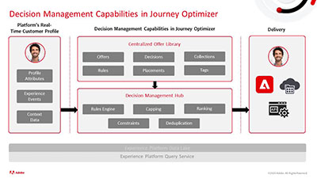

# Vidéos et tutoriels sur Journey Optimizer

Journey Optimizer permet aux sociétés de proposer des expériences connectées, contextuelles et personnalisées à leurs clients. Le parcours client représente l’ensemble du processus d’interaction d’un client avec la marque, à partir du premier contact jusqu’au départ du client.

Ce guide de l’utilisateur contient des vidéos et des tutoriels sur les fonctionnalités d’Adobe Journey Optimizer.

## Nouveautés

### Tutoriels

* **[Créer une campagne](/help/create-champaigns/create-a-campaign.md)**

   *Découvrez comment diffuser du contenu unique à une audience spécifique en exécutant immédiatement des actions ou selon un planning spécifié.*

* **[Configurer, créer et diffuser des messages SMS](/help/create-messages/configure-author-and-deliver-sms-messages.md)**

   *Découvrez comment configurer, créer et inclure des messages SMS dans vos parcours clients.*

* **[Prise en charge des mots-clés entrants pour les SMS](/help/create-messages/inbound-keyword-support-for-sms.md)**

   *Découvrez comment fonctionne la prise en charge native des mots-clés entrants (démarrage, arrêt, redémarrage) pour les SMS.*

### Événements Experience League Live

* **[Notifications push avec Adobe Journey Optimizer](https://experienceleague.adobe.com/docs/experience-league-live-events/events/episodes/exl-live-episode-05-12-22.html?lang=fr)**

   *Dans cet épisode d’Experience League Live, découvrez les cas d’utilisation courants des notifications push avec Adobe Journey Optimizer et explorez les détails techniques de la configuration d’une application pour les notifications push optimisée par Adobe Experience Platform.*

## Choix du personnel

<table>
<tr>
  <td>
    
    

      <a href="./introduction/journey-optimizer-overview-part-1.md">
    <strong>Présentation de Journey Optimizer (partie 1) </strong>
    </a>
    

    

    <em>Cette vidéo montre comment les marques peuvent utiliser Adobe Journey Optimizer pour proposer des parcours omnicanal personnalisés à leurs clients.</em>
    

  </td>
    <td>
    
    

      <a href="./introduction/journey-optimizer-overview-part-2.md">
    <strong>Présentation de Journey Optimizer (partie 2) </strong>
    </a>
    

    

    <em>Cette vidéo montre comment les marques peuvent utiliser les fonctionnalités de gestion des décisions, la qualification de segments en temps réel et la gestion des événements métier d’Adobe Journey Optimizer pour optimiser les parcours clients.</em>
    

  </td>
  </td>
    <td>
    
    

      <a href="./decision-management/create-decisions.md">
    <strong>Présentation des fonctionnalités de gestion des décisions </strong>
    </a>
    

    

    <em>La vidéo couvre les défis commerciaux que les fonctionnalités de gestion des décisions résolvent, ses fonctionnalités clés, l’architecture de base et ses principaux cas d’utilisation.

</em>
    

  </td>
</tr>
<tr>
  <td>
    
    

      <a href="./create-journeys/use-case-transactional-journey.md">
    <strong>Cas d’utilisation : parcours transactionnel </strong>
    </a>
    

    

    <em>Comprenez les cas d’utilisation applicables pour les parcours transactionnels. Découvrez comment créer des parcours transactionnels et les bonnes pratiques à appliquer.</em>
    

  </td>
    <td>
    
    

      <a href="./personalize-content/use-contextual-event-information-for-personalization.md">
    <strong>Utilisation d’informations d’événement contextuelles pour la personnalisation </strong>
    </a>
    

    

    <em>Découvrez comment utiliser les informations d’événement contextuelles d’un parcours pour personnaliser un message.</em>
    

  </td>
  </td>
    <td>
    
    

      <a href="./report-and-monitor/live-and-global-reports.md">
    <strong>Rapports dynamiques et globaux </strong>
    </a>
    

    

    <em>Apprenez la différence entre les rapports dynamiques et globaux. Découvrez également comment accéder aux rapports spécifiques sur les messages et les parcours et les analyser et comment modifier les tableaux de bord des rapports.

</em>
    

  </td>
</tr>
</table>
