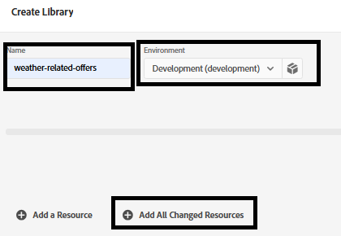

# Création de balises AEP

Les balises Adobe Experience Platform (anciennement Adobe Launch) permettent de gérer et de déployer* des technologies de marketing et d’analyse sur votre site web sans avoir à modifier le code du site.

Cette [ vidéo décrit le processus de création d’Adobe Experience Tags](https://experienceleague.adobe.com/en/playlists/experience-platform-get-started-with-tags)

- Connexion à la collecte de données
- Cliquez sur _**Balises -> Nouvelle propriété**_

- Créez une balise Adobe Experience Platform appelée _**personalization-on-weather**_.

- Ajoutez les extensions suivantes à la balise .
  
- Ajoutez un élément de données appelé « ECID », comme illustré ci-dessous. Cet élément de données est utilisé ultérieurement dans les rapports
  

- Veillez à configurer le SDK Web Adobe Experience Platform pour utiliser l’environnement approprié et le **flux de données lié à la météo** créé à l’étape précédente.
  


## Création et déploiement d’AEP Tags


Créez une bibliothèque et ajoutez-y toutes les ressources modifiées, comme illustré dans les captures d’écran ci-dessous.

**Ajouter une bibliothèque**


**Créer une bibliothèque**

Dans l’écran Créer une bibliothèque , spécifiez le nom de la bibliothèque et l’environnement.

Ajouter toutes les ressources modifiées à cette bibliothèque


Cliquez ensuite sur le bouton Enregistrer et créer dans le développement pour créer la bibliothèque

## Inclure les balises AEP dans la page HTML

Lorsque vous publiez une propriété AEP Tags, Adobe vous fournit une balise de script que vous devez placer dans votre ``` <head>``` HTML ou au bas des balises ``` <body>```.

- Accédez à la propriété Balises (personnalisation selon la météo) .

- Cliquez sur Environnements et cliquez sur l’icône d’installation de l’environnement souhaité (par exemple, Développement, Évaluation, Production).

- Notez le code incorporé. Vous en aurez besoin à un stade ultérieur de ce tutoriel.
