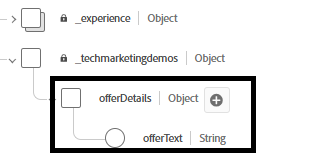

# Créer des offres pour tester la prise de décision et le classement dynamiques

Ces offres sont conçues pour tester la prise de décision et le classement dynamiques en fonction des entrées contextuelles en temps réel (telles que la température) transmises par le biais du SDK web Adobe (alloy(« sendEvent »)).

Avant de créer les offres, le schéma Article de l&#39;offre a été étendu pour inclure un nouveau champ : offerText

.

Créez les 3 offres suivantes


## Offre Par Temps Chaud (Balise:hot)

Le texte des offres pour les offres par temps chaud

```html
<div data-tags="weather hot skincare sunscreen" style="border: 1px solid #e0e0e0; padding: 1.5rem; border-radius: 10px; background-color: #fff3e0;">   <h2 style="color: #e65100;">Protect Your Skin This Summer</h2>   <p>High temperatures mean high UV risk. Get <strong>20% off</strong> our dermatologist-recommended sunscreens and skin protection kits.</p>   <p>Offer valid this week only for areas with temperatures over 90°F.</p> <button  class="ajo-cta"> Shop Sunscreen</button>   </div>
```


## Offre Par Temps Doux (Balise:spring)

Texte de l’offre en cas de temps doux

```html
<div class="offer-content" style="text-align: center; padding: 1rem;">      <h2>Grow More Than Just Flowers 🌿</h2>   <p>     Spring is here, and it's the perfect time to cultivate your garden — and your savings!     Enjoy <strong>$50 off</strong> when you spend $250 or more on gardening tools, seeds, and accessories.   </p>   <p><strong>Promo Code:</strong> <code>GROWSPRING</code></p>   <p><em>Offer valid through May 31. Let your garden — and your wallet — thrive.</em></p> <button  class="ajo-cta"> YES,I want this offer</button> </div>
```

## Offre Par Temps Froid (Balise:cold)

Texte de l’offre pour l’offre par temps froid

```html
<div class="offer-content" style="text-align: center; padding: 1rem;">      <h2>Cold Weather, Hot Deals 🧤</h2>   <p>Stay warm in style with our exclusive <strong>25% off</strong> winter outerwear. From puffer jackets to wool scarves, find the perfect layers to beat the chill.</p>   <p><strong>Use code:</strong> <code>WINTER25</code> at checkout</p>   <p><em>Limited time offer. While supplies last.</em></p><button  class="ajo-cta"> Shop Sunscreen</button> </div>
```

### Créer une collection

Accédez à **_Prise de décision -> Catalogues ->Collection->Créer une collection_**
Nommez la collection **Weather-Related-Offers**

Regroupez ces offres dans cette collection à l’aide du créateur de règles.

