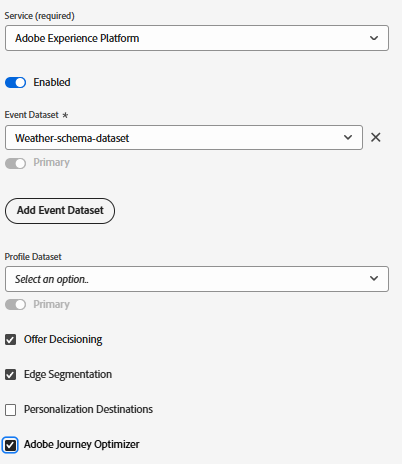

# Configurer un schéma, un jeu de données et un flux de données XDM dans AEP

## Créer un schéma XDM

Pour utiliser Adobe Experience Platform Web SDK (Alloy.js) sur une page web, les balises AEP doivent être associées à un flux de données mappé à un schéma d’événement XDM. Le SDK Web (alloy.sendEvent) envoie des données dans AEP en tant qu’événements d’expérience, qui doivent être conformes à un schéma XDM basé sur la classe XDM ExperienceEvent .

Pour créer un schéma XDM

- Connexion à Adobe Experience Platform
- Accédez à _&#x200B;**Gestion des données -> Schémas -> Créer un schéma**&#x200B;_

- Créez un schéma basé sur un événement XDM appelé **_Weather-Schema_**. Si vous ne connaissez pas la création d’un schéma, consultez cette [documentation](https://experienceleague.adobe.com/en/docs/experience-platform/xdm/tutorials/create-schema-ui)

- Assurez-vous que le schéma comporte les champs suivants avec le type de données approprié.

- 

- Ajoutez le groupe de champs _&#x200B;**Détails web**&#x200B;_ au schéma. Ce groupe de champs est requis à des fins de création de rapports.

## Création d’un jeu de données basé sur le schéma

Un **jeu de données dans Adobe Experience Platform (AEP)** est un conteneur de stockage structuré utilisé pour ingérer, stocker et activer des données en fonction d’un schéma XDM défini.

- Accédez à _&#x200B;**Gestion des données -> Jeux de données -> Créer un jeu de données**&#x200B;_
- Créez un jeu de données appelé **_Weather-schema-dataset_** basé sur le schéma XDM (_&#x200B;**Weather-Schema**&#x200B;_) créé à l’étape précédente.

## Créer un flux de données

Un flux de données dans Adobe Experience Platform est comme un pipeline (ou une autoroute) sécurisé qui connecte votre site web ou votre application aux services Adobe, permettant aux données d’entrer et au contenu personnalisé de revenir.

- Accédez à _&#x200B;**Collecte de données > Flux de données**&#x200B;_, puis cliquez sur Nouveau flux de données. Nommez le flux de données **weather-related-datastream**

- Fournissez les détails suivants, comme illustré dans la capture d’écran ci-dessous.
  
- Cliquez sur Enregistrer , puis sur Ajouter un mappage et ajoutez le service Adobe Experience Platform et le jeu de données d’événement avec les cases à cocher appropriées sélectionnées
  

- Enregistrez le flux de données.

>[!NOTE]
>
>Notez que les jeux de données nouvellement créés peuvent prendre jusqu’à 24 heures avant d’être disponibles pour sélection dans la formule de classement ou l’éditeur Personalization.
