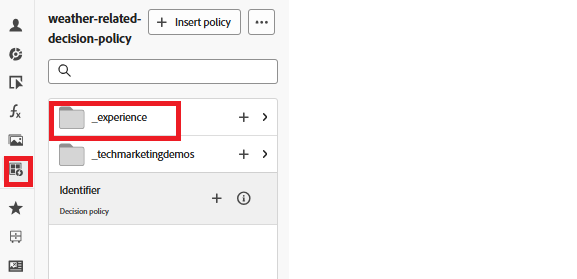

# Ajouter des jetons de suivi aux éléments d’offre

Pour modifier le code dans l’éditeur de personnalisation, procédez comme suit :

Accédez à _&#x200B;**Gestion des Parcours ->Campagnes**&#x200B;_

Ouvrez la campagne appropriée et cliquez sur le bouton _&#x200B;**Arrêter la campagne**&#x200B;_ pour arrêter la campagne.

Ouvrez la campagne arrêtée et cliquez sur le bouton _&#x200B;**Modifier la campagne**&#x200B;_.

Cliquez sur l’onglet _&#x200B;**Contenu**&#x200B;_ puis sur le bouton _&#x200B;**Modifier le code**&#x200B;_ pour ouvrir l’éditeur de personnalisation.

Ajoutez deux nouveaux attributs de données à la balise div, comme illustré dans la capture d’écran

Vous pouvez ajouter les éléments trackingToken et ItemID en cliquant sur l’icône Politique de décision dans le volet de navigation de gauche, puis en faisant défiler l’arborescence de prise de décision pour sélectionner les éléments itemID et trackingToken.

Cela garantit que chaque offre rendue inclut un jeton de suivi des données, essentiel pour un suivi précis des événements d’impression et de clic.

Enregistrez les modifications et activez la campagne.
