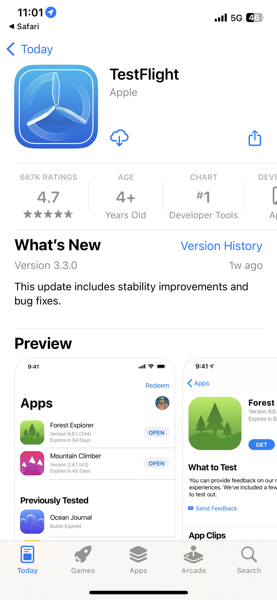
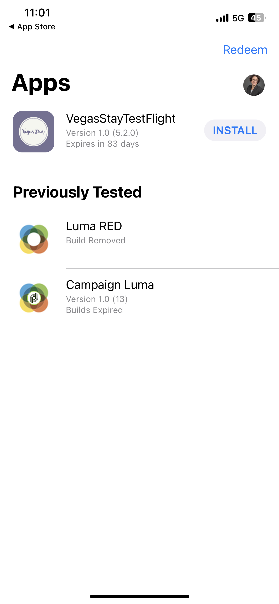

# Summit Lab L731 - Aide-mémoire

Cette page comporte du texte et des liens utilisés dans le L731 Summit Lab. Cela vous permet de copier et coller le contenu dans vos messages Journey Optimizer.

## Exercice 1.1 : télécharger et installer l’application

Analyser le code QR pour télécharger l’application

>[!BEGINTABS]

>[!TAB iOS]

Vous serez invité à installer Testflight, les étapes 1 à 4. Une fois que vous avez installé Testflight, suivez les étapes 5 à 8 pour installer l’application de séjour Vegas :

<table>
<tr>
</tr>
<tr>
<td>
 

      

      <b>Étape 1 </b>
      

      
      

  </td>
  <td>
 

      

      <b>Étape 2 </b>
      

      
      

  </td>
  <td>
 

      

      <b>Étape 3 </b>
      

      
      

  </td>
  <td>
 

      

      <b>Étape 4 </b>
      

      
      

  </td>
  </tr>
  <tr>
<td>
 

      

      <b>Étape 5 </b>
      

      
      

  </td>
  <td>
 

      

      <a>
      <b>Étape 6 </b>
      

        
      </a>
      

  </td>
  <td>
 

      

      <a>
      <b>Étape 7 </b>
      

        
      </a>
      

  </td>
  <td>
 

      

      <a>
      <b>Étape 8 </b>
      

        
      </a>
      

  </td>
  </tr>
</table>

>[!TAB Android]

Si vous utilisez le simulateur Android, utilisez ce lien : [https://ajolab.s3.amazonaws.com/ajolabapp-release.apk](https://ajolab.s3.amazonaws.com/ajolabapp-release.apk)

L’application n’étant pas enregistrée auprès de la boutique Google Play, vous recevrez un message d’avertissement :

Cliquez sur **Installer quand même**

>[!ENDTABS]

## Exercice 1.3 : se connecter à Adobe Journey Optimizer

[Cliquez ici pour vous connecter à Journey Optimizer](https://experience.adobe.com/#/@techmarketingdemos/sname:summit-2023-ajo-lab/journey-optimizer/home).

**Identifiants de connexion :**

* **Nom d’utilisateur :** `L731+<your seat number>@summitlab.us` (exemple : L731+001@summitlab.us)
* **Mot de passe :** Adobe2023 !

## Exercice 2.1 : créer une campagne in-app

| Champ | Texte | Liens |
|----|----|----|
| Nom de la campagne | `<your seat number> March Vegas Campaign` |  |
| Correspondance | booknow |  |
| Option URL de médias |  | https://mcfadyen.com/wp-content/uploads/2023/01/Adobe-Summit-2023-Banner.png |
| Titre | C&#39;est en train d&#39;arriver et c&#39;est en direct ! |  |
| Corps | L’Adobe Summit est de retour à Las Vegas du 21 au 23 mars 2023. Préparez-vous à des interventions passionnantes, à des sessions pour accroître vos compétences et à de nouvelles rencontres. |  |
| Bouton | Réservez un hôtel dès maintenant et économisez 10 %. | lab://booking?suite=presidential&amp;discount=10 |
| Bouton : événement interactif | Apple à l’action in-app |  |
| URL de base |  | iOS : lab://  Android&amp; : https://lab |

## Leçon 3 : créer un parcours omnicanal

**Libellé du parcours :**
`<your seat number>` - Parcours de bienvenue

>[!BEGINTABS]

>[!TAB Message push]

**Libellé :**
Message de bienvenue

**Titre:**\
Bienvenue sur Vegas Stay !

**Corps:**\
Ne faites pas la queue et enregistrez-vous avec l’application mobile.

**Deeplink :** lab://checkin

**Média:**

https://experienceleague.adobe.com/docs/journey-optimizer-learn/assets/vegas_online_check_in.jpg?lang=en

Il s’agit de l’image que nous utilisons pour la notification push :

>[!TAB SMS Message]

**Libellé :**
Message de bienvenue

**Message :**
Bienvenue à Vegas Rester. Ne faites pas la queue et enregistrez-vous avec l’application mobile : lab://checkin.

>[!TAB Message électronique]

**Libellé :**
Message de confirmation

**Objet :**
{{profile.person.name.firstName}}, vous êtes enregistré, maintenant consultez nos offres pour votre séjour !

>[!ENDTABS]
