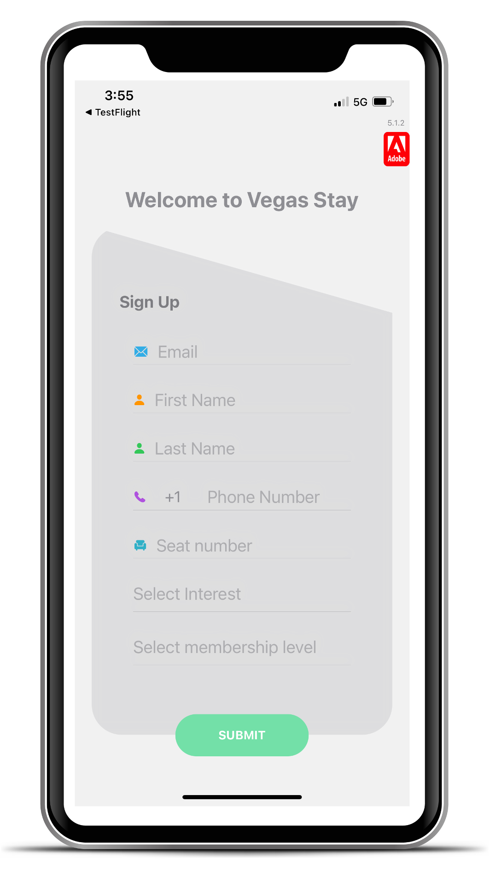

# Exercice 1.2 : s’enregistrer en tant qu’utilisateur ou utilisatrice avec l’application

>[!IMPORTANT]
>Inscrivez-vous en utilisant une **adresse e-mail à laquelle vous pouvez accéder au cours de la session de ce Lab**. Indiquez également **votre numéro de téléphone mobile**.
>
> Ces informations sont requises pour que vous puissiez recevoir les messages que vous enverrez. Elles vous permettront également d’accéder à vos informations dans Journey Optimizer. Elles ne seront pas utilisées à d’autres fins en dehors de ce Lab.

1. Ouvrez l’application.
1. Dans la fenêtre contextuelle, cliquez sur Autoriser.
1. Inscrivez-vous :

   Lors de la première ouverture de l’application, cette dernière vous propose de vous inscrire. Saisissez les informations suivantes :

   <table>
    <tr>
    <td>
    

     
    

    </td>
    <td>
    <strong>Email : </strong> saisissez une adresse e-mail à laquelle vous pouvez accéder pendant le Lab.
    

    <strong>Prénom, Nom</strong>
    

    <strong>Numéro de téléphone : </strong> saisissez votre numéro de téléphone mobile au format suivant : 
    
+16501245566 (+code du pays).
    

    <strong>Numéro de poste : </strong> le numéro de votre poste se trouve sur votre station de travail. Il est TRÈS IMPORTANT de saisir le bon numéro de poste.
    

    <strong>Sélectionnez le centre d’intérêt : </strong> sports, bien-être, restauration ou divertissement.
    

    <strong>Sélectionnez le niveau d’adhésion : </strong> rouge, bleu, vert ou jaune.

    </td>
    </tr>
    </table>

1. Cliquez sur **Envoyer**.

>[!SUCCESS]
>
>Vous avez créé un utilisateur ou une utilisatrice de l’application. Un profil a été créé dans Adobe Journey Optimizer.
>
