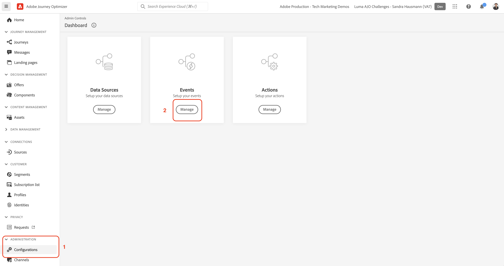

# Configuration des événements

Dans cette section, vous configurez les trois événements requis pour les exercices pratiques dans la variable [Défis liés à Journey Optimizer](/help/challenges/introduction-and-prerequisites.md).

Regarder la vidéo [Créer des événements](/help/set-up-journeys/create-events.md) pour savoir comment créer des événements.

## Créer un événement d’achat Luma Online

1. Dans le volet de navigation de gauche, accédez à [!UICONTROL ADMINISTRATION] et sélectionnez *[!UICONTROL Configuration]*
1. Dans la [!UICONTROL Tableau de bord], sélectionnez *[!UICONTROL Gérer*]* Événements

1. Cliquez sur *[!UICONTROL Créer un événement]*
1. Renseignez les détails et les paramètres de l’événement :

   | [!UICONTROL Paramètre] | [!UICONTROL Valeur] |
   |-------------|-----------|
   | [!UICONTROL NOM] | `LumaOnlinePurchase` |
   | [!UICONTROL TYPE] | [!UICONTROL Unitaire] |
   | [!UICONTROL Type d’identifiant d’événement] | [!UICONTROL Basé sur des règles] |
   | [!UICONTROL Schéma] | Interactions produit Luma |
   | [!UICONTROL Champs] | EventType  Order.priceTotal purchaseOrderNumber productListItems.quantity <b>Dans Éléments de liste de produits > Produits Luma > _*[!DNL yourOrganizationID]* > Produit :</b>   Nom Prix ProductImageURL ProductURL |

1. Ajoutez la variable [!UICONTROL Condition d’identifiant d’événement]: **[!DNL LumaOnlinePurchase.eventType is commerce.purchases]**

   1. Sélectionner l’icône représentant un crayon pour modifier le champ
   2. Sur le [!UICONTROL Ajout d’une condition d’identifiant d’événement] modale, faites glisser et déposez le `eventType` sur la zone de travail
   3. Sélectionner `commerce.purchases`
   4. Sélectionnez ok sur la zone de travail.
   5. Sélectionnez ok sur le modal.

1. Sélectionner [!UICONTROL ESPACE DE NOMS]: `Email(Email)`

1. Sélectionnez **[!UICONTROL Enregistrer]**.

## Créer *[!DNL Luma Wishlist Add]* Événement

| [!UICONTROL Paramètre] | [!UICONTROL Valeur] |
|-------------|-----------|
| [!UICONTROL NOM] | `LumaWishlistAdd` |
| [!UICONTROL TYPE] | [!UICONTROL Unitaire] |
| [!UICONTROL Type d’identifiant d’événement] | [!UICONTROL Basé sur des règles] |
| [!UICONTROL Schéma] | `Luma Product Interactions` |
| [!UICONTROL Champs] | EventType productListItem.quantity <b>Dans Éléments de liste de produits > Produits Luma > _*[!DNL yourOrganizationID]* > Produit :</b>  Nom Prix  ProductImageURL ProductURL |
| [!UICONTROL Condition] | [!DNL LumaWishlistAdd.eventType is commerce.saveForLaters] |
| [!UICONTROL Espace de noms] | Email(EMail) |

## Créer *[!DNL Luma Product Restock] Événement

| [!UICONTROL Paramètre] | [!UICONTROL Valeur] |
|-------------|-----------|
| [!UICONTROL NOM] | `LumaProductRestock` |
| [!UICONTROL TYPE] | [!UICONTROL Commerciale] |
| [!UICONTROL Schéma] | [!DNL Luma Product Inventory Events] |
| [!UICONTROL Champs] | productID   stockEventType <b>Dans Produit > Produits Luma > *[!DNL yourOrganizationID]* > Produit :</b>  Nom Prix  ProductImageURL Description |
| [!UICONTROL Condition] | LumaProductRestock._`your organization's ID`.inventoryEvent.stockEventType is restock |

## Félicitations

Votre environnement de test est maintenant prêt à l’emploi !
