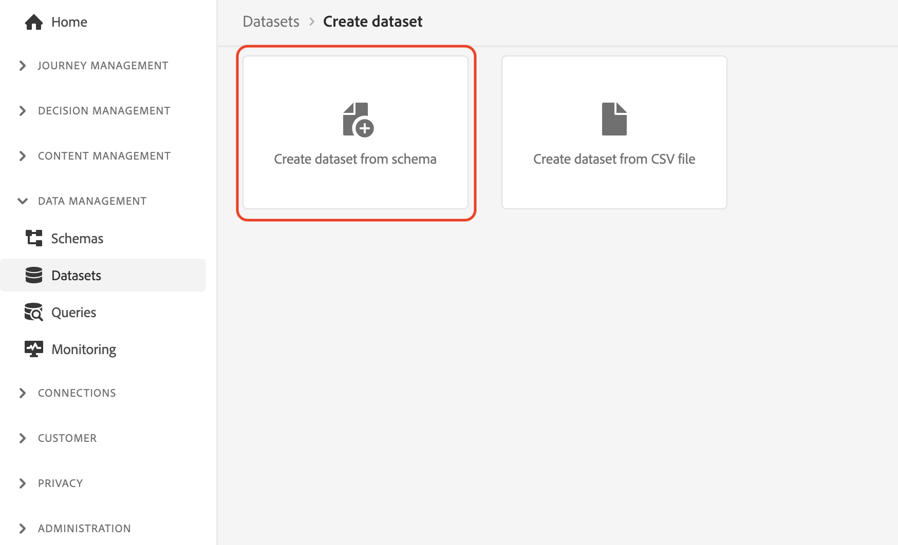

# Ingestion manuelle des données

Cette section vous guide tout au long des étapes requises pour créer des jeux de données et ingérer des données d’exemple.

>[!TIP]
>
> Regardez le tutoriel vidéo [Création de jeux de données et ingestion de données](/help/set-up-data/create-datasets-and-ingest-data.md) avant de commencer.

Vous allez créer cinq [!UICONTROL jeux de données] selon le Luma [!UICONTROL schémas] que vous avez créé dans la variable [section précédente](/help/tutorial-configure-a-training-sandbox/manual-data-set-up.md). Une fois les jeux de données créés, vous pouvez ingérer des données à partir des fichiers JSON que vous avez téléchargés et modifiés. (Voir [Introduction et conditions préalables](/help/tutorial-configure-a-training-sandbox/introduction-and-prerequisites.md) pour obtenir des instructions).

## Création du premier jeu de données

Création d’un jeu de données nommé *[!DNL Luma Loyalty Data]* de [!DNL Luma Loyalty schema]

1. Dans le volet de navigation de gauche, sous [!UICONTROL GESTION DES DONNÉES], sélectionnez **[!UICONTROL Jeux de données]**.

1. Sélectionner **[!UICONTROL Création d’un jeu de données]**.

   

1. Sur la page suivante, sélectionnez [!UICONTROL Création d’un jeu de données à partir d’un schéma].

   

1. Sur la page suivante, recherchez la variable *[!DNL Luma Loyalty]* schéma que vous avez créé précédemment.

1. Sélectionner *[!DNL Luma Loyalty]*.

1. Cliquez sur **[!UICONTROL Suivant]**.

   

1. Configurez le jeu de données :

   * Nom: `Luma Loyalty Data`

1. Cliquez sur **[!UICONTROL Terminer]**.

   

## Ingestion de données d’exemple

Après avoir créé un jeu de données, vous pouvez ingérer des données dans le jeu de données.

1. Sur le [!DNL Luma Loyalty Data] , faites défiler la page vers le bas du panneau de droite vers le [!UICONTROL AJOUT DE DONNÉES] et activez :

   * **[!UICONTROL Diagnostics d’erreur]** et

   * **[!UICONTROL Ingestion partielle]**

   

1. Faites glisser et déposez le `luma-loyalty.json` pour charger des exemples de données dans le jeu de données.

1. Actualisez la page et vérifiez l’état du lot pour confirmer que le fichier a été correctement ingéré.

   375 enregistrements doivent avoir été ingérés. L’ingestion des données peut prendre quelques minutes.

>[!TIP]
>
>Si le lot échoue, veillez à remplacer l’ID d’organisation dans la variable `luma-loyalty.json` avec votre [ID d’organisation](https://experienceleague.adobe.com/docs/core-services/interface/administration/organizations.html?lang=fr).

## Créer cinq [!UICONTROL jeux de données]

Créez ensuite les cinq éléments supplémentaires suivants : [!UICONTROL jeux de données] et ingérez les données dans la variable `Luma CRM Data`, la variable `Luma Products Data`, et la variable `Luma Test Profiles` ensembles de données.

| Nom du jeu de données | À partir du schéma | Fichier à ingérer | Enregistrements |
| -----| ------ | -------| ------- |
| `Luma CRM Data` | `Luma CRM` | `luma-crm.json` | 500 |
| `Luma Products Data` | `Luma Products` | `luma-products.json` | 92 |
| `Luma Product Interactions Data` | `Luma Product Interactions` | aucun | 0 |
| `Luma Product Inventory Events` | `Luma Product Inventory Events` | aucun | 0 |
| `Luma Test Profiles` | `Luma Test Profiles` | `luma-test-profiles.json` | 3 |

## Étapes suivantes

Vous avez créé tous les jeux de données requis et ingéré les données d’exemple. La dernière étape consiste à [configuration des événements](/help/tutorial-configure-a-training-sandbox/configure-events.md).
