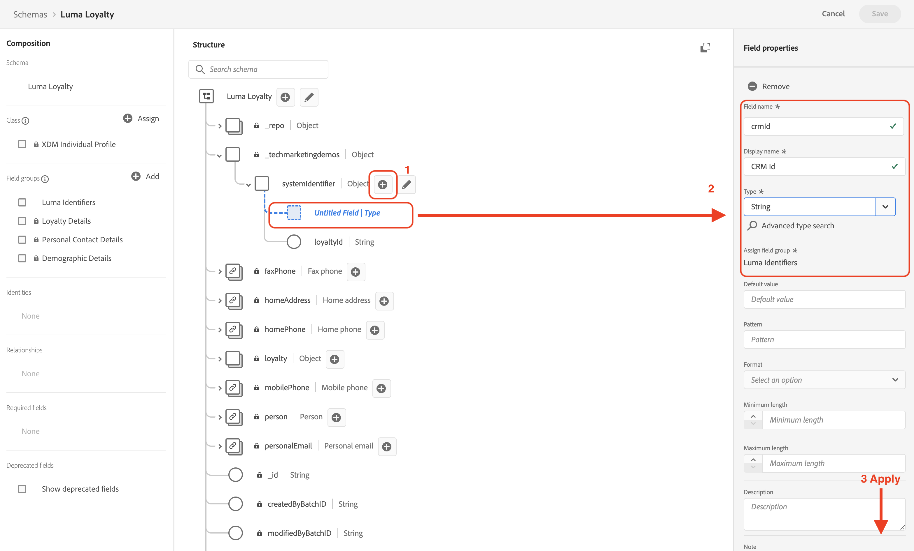

# Configurer les données manuellement

Dans cette section, vous créez les espaces de noms d’identité requis et définissez les exemple de structure de données [!DNL Luma] en créant les [[!UICONTROL schémas]](https://experienceleague.adobe.com/docs/experience-platform/xdm/schema/composition.html?lang=fr).

>[!TIP]
>Regardez le tutoriel vidéo [Mapper les identités](/help/set-up-data/map-identities.md) avant de commencer.

## Étape 1 : créer des espaces de noms d’identité

Au cours de cette étape, vous créez des espaces de noms d’identité pour les champs d’identité personnalisés [!DNL Luma] nommés `lumaLoyaltyId`, `lumaCrmId`, et `lumaProductSKU`. Les espaces de noms d’identité jouent un rôle essentiel dans la création de profils clients en temps réel, car deux valeurs correspondantes dans le même espace de noms permettent à deux sources de données de former un graphique d’identité.

Commencez par créer un [!UICONTROL espace de noms] pour le schéma [!DNL Luma Loyalty ID] :

1. Dans l’interface utilisateur de Journey Optimizer, accédez à **[!UICONTROL Client]** > **[!UICONTROL Identités]** dans le volet de navigation de gauche.

1. Sélectionnez **[!UICONTROL Créer un espace de noms d’identité]**.

1. Indiquez les informations suivantes :

   | Nom d’affichage | Symbole d’identité | Type |
   |---|---|---|
   | `Luma Loyalty ID` | `lumaLoyaltyId` | [!UICONTROL Identifiant sur plusieurs appareils] |

1. Sélectionnez **[!UICONTROL Créer]**.

   

1. Créez deux espaces de noms supplémentaires en procédant de la même manière :

   | Nom d’affichage | Symbole d’identité | Type |
   |---|---|---|
   | `Luma CRM ID` | `lumaCrmId` | [!UICONTROL Identifiant sur plusieurs appareils] |
   | `Luma Product SKU` | `lumaProductSKU` | [!UICONTROL Identifiant non-humain] |

## Étape 2 : créer des schémas

Au cours de cette étape, vous définissez la structure des données d’exemple en créant six [[!UICONTROL schémas]](https://experienceleague.adobe.com/docs/experience-platform/xdm/schema/composition.html?lang=fr) :

* [[!DNL Luma Loyalty Schema]](#create-luma-loyalty-schema)

* [[!DNL Luma Product Catalog Schema]](#create-luma-product-catalog-schema)

* [Schéma [!DNL Luma Product Inventory Events]](#create-luma-product-inventory-event-schema)

* [[!DNL Luma CRM Schema]](#create-luma-crm-and-luma-product-interactions-schemas)

* [[!DNL Luma Web Events Schema]](#create-luma-crm-and-luma-product-interactions-schemas)

* [[!DNL Luma Offline Purchase Events Schema]](#create-additional-schemas)

* [[!DNL Luma Test Profiles Schema]](#create-additional-schemas)

>[!TIP]
>
>Regardez le tutoriel vidéo [Créer un schéma](/help/set-up-data/create-schema.md) avant de commencer.

### Créer [!DNL Luma Loyalty Schema] {#create-luma-loyalty-schema}

Cette section décrit comment créer le schéma [!DNL Luma Loyalty] et configurer des groupes de champs.

#### Créer le schéma

1. Accédez à **[!UICONTROL GESTION DES DONNÉES]** > **[!UICONTROL Schémas]** dans le volet de navigation de gauche.

1. Sélectionnez **[!UICONTROL Créer un schéma]** en haut à droite.

1. Dans le menu déroulant, sélectionnez **[!UICONTROL XDM Individual Profile]**.

   Vous sélectionnez cette option car vous modélisez les attributs d’une personne cliente individuelle (points, statut, etc.).

#### Ajouter des groupes de champs existants

Vous devez ensuite ajouter des groupes de champs au schéma à l’aide des groupes. Vous devez ajouter des groupes de champs existants et créer un groupe de champs.

1. Sur la page [!UICONTROL Schéma], si la boîte de dialogue modale de groupes de champs ne s’est pas ouverte automatiquement, sélectionnez **[!UICONTROL Ajouter]**.

   

1. Sur la page **[!UICONTROL Ajouter des groupes de champs]**, activez les groupes de champs suivants :

   * **[!UICONTROL Détails démographiques]** pour les données de base des clientes et clients, telles que le nom et la date de naissance.

   * **[!UICONTROL Coordonnées personnelles]** pour les coordonnées de base, telles que l’adresse e-mail et le numéro de téléphone.

   * **[!UICONTROL Détails de fidélité]** pour les détails de fidélité, tels que les points, la date d’inscription ou le statut. Le groupe de champs de fidélité est très bas dans la liste. Il est donc plus facile de le rechercher.

1. Sélectionnez **[!UICONTROL Ajouter un groupe de champs]** pour ajouter les trois groupes de champs au schéma.

   

1. Sélectionnez le nœud supérieur du schéma.

1. Saisissez `Luma Loyalty Schema` comme **[!UICONTROL Nom d’affichage]**.

#### Créer un [!UICONTROL groupe de champs] {#create-field-group}

Pour garantir la cohérence entre les schémas, Adobe recommande de gérer tous les identifiants système dans un seul groupe :

1. Dans la section **[!UICONTROL Composition]** sous [!UICONTROL Groupes de champs], sélectionnez **[!UICONTROL Ajouter]**.

1. Sélectionnez **[!UICONTROL Créer un groupe de champs]**.

1. Ajoutez `Luma Identity Profile Field Group` comme **[!UICONTROL Nom d’affichage]**.

1. Ajoutez `system identifiers for XDM Individual Profile class` comme **[!UICONTROL Description]**.

1. Sélectionnez **[!UICONTROL Ajouter des groupes de champs]**.

   

#### Ajouter des champs au nouveau [!UICONTROL groupe de champs]

Le nouveau groupe de champs vide est ajouté à votre schéma. Les boutons + vous permettent d’ajouter de nouveaux champs à n’importe quel emplacement de la hiérarchie. Dans ce cas, vous devez ajouter des champs au niveau racine :

1. Sélectionnez **[!UICONTROL +]** en regard du nom du schéma.

   Cette étape permet d’ajouter un champ sous l’espace de noms de **votre identifiant client** pour gérer les conflits entre vos champs personnalisés et les champs standards.

1. Dans la barre latérale **[!UICONTROL Propriétés du champ]**, ajoutez les détails du nouveau champ :

   * **Nom du champ :** `systemIdentifier`

   * **[!UICONTROL Nom d’affichage] :** `System Identifier`

   * **Type :** objet

   * **[!UICONTROL Attribuer un groupe de champs] :** [!DNL Luma identifiers]

1. Sélectionnez **[!UICONTROL Appliquer]**.

   

   Ajoutez deux champs sous l’objet `systemIdentifier` :

   | [!UICONTROL FieldName] | [!UICONTROL Nom d’affichage] | [!UICONTROL Type] |
   |-------------|-----------|----------|
   | `loyaltyId` | `Loyalty Id` | [!UICONTROL Chaîne] |
   | `crmId` | `CRM Id` | [!UICONTROL Chaîne] |

#### Définir des identités

L’[!UICONTROL espace de noms] et le [!DNL Luma Loyalty schema] sont maintenant configurés. Avant d’ingérer des données, vous devez étiqueter les champs d’identité. Chaque schéma utilisé avec le [!UICONTROL profil client en temps réel] est requis pour qu’une identité principale soit spécifiée et chaque enregistrement ingéré doit avoir une valeur pour ce champ.

1. Définissez l’**identité principale** :

   Depuis le **[!DNL Luma Loyalty Schema]** :

   1. Sélectionnez le **[!DNL Luma Identity Profile Field Group]**.

   2. Sélectionnez le champ **[!DNL loyaltyId]**.

   3. Dans les **[!UICONTROL propriétés du champ]**, activez la boîte **[!UICONTROL Identité]**.

   4. Activez la boîte **[!UICONTROL Identité principale]**.

   5. Sélectionnez l’espace de noms `Luma Loyalty Id` dans le menu déroulant **[!UICONTROL Espaces de noms d’identité]**.

   6. Sélectionnez **[!UICONTROL Appliquer]**.

      

2. Définissez une **identité secondaire** :

   Depuis le **[!DNL Luma Loyalty Schema]** :

   1. Sélectionnez le **[!DNL Luma Identity Profile Field Group]**.

   2. Sélectionnez le champ `crmId`.

   3. Dans les **[!UICONTROL propriétés du champ]**, activez la boîte **[!UICONTROL Identité]**.

   4. Sélectionnez l’espace de noms `Luma CRM Id` dans le menu déroulant **[!UICONTROL Espaces de noms d’identité]**.

   5. Sélectionnez **[!UICONTROL Appliquer]**.

#### Activer pour le profil et enregistrer le schéma

1. Sélectionnez le nœud supérieur du schéma.

1. Dans les [!UICONTROL propriétés du champ], activez le **[!UICONTROL profil]**.

   Le schéma doit se présenter de la manière suivante :

   

1. Sélectionnez **[!UICONTROL Enregistrer]**.

### Créer [!DNL Luma Product Catalog Schema] {#create-luma-product-catalog-schema}

1. Accédez à **[!UICONTROL GESTION DES DONNÉES]** > **[!UICONTROL Schémas]** dans le volet de navigation de gauche.

1. Sélectionnez **[!UICONTROL Créer un schéma]** (en haut à droite).

1. Pour créer une classe, sélectionnez **[!UICONTROL Parcourir tous les types de schéma]** dans le menu déroulant.

1. Sélectionnez **[!UICONTROL Créer une classe]**.

1. Ajoutez le nom d’affichage : `Luma Product Catalog Class`.

1. Attribuez une classe.

1. Créez un [!UICONTROL groupe de champs] :

   * Nom d’affichage: `Luma Product Catalog Field Group`

1. Ajoutez le champ suivant au **[!DNL Luma Product Catalog Field Group]**.

   * Nom du champ : `product`

   * Nom d’affichage : `Product`

   * Type : [!UICONTROL objet]

   * Groupe de champs : [!DNL Luma Product Catalog Field Group]

1. Sélectionnez **[!UICONTROL Appliquer]**.

1. Ajoutez les champs suivants à l’objet **[!DNL Product]** :

   | [!UICONTROL Fieldname] | [!UICONTROL Nom d’affichage] | [!UICONTROL Type] |
   |-------------|-----------|----------|
   | `sku` | `Product SKU` | [!UICONTROL Chaîne] |
   | `name` | `Product Name` | [!UICONTROL Chaîne] |
   | `category` | `Product Category` | [!UICONTROL Chaîne] |
   | `color` | `Product Color` | [!UICONTROL Chaîne] |
   | `size` | `Product Size` | [!UICONTROL Chaîne] |
   | `price` | `Product Price` | [!UICONTROL Double] |
   | `description` | `Product Description` | [!UICONTROL Chaîne] |
   | `imageUrl` | `Product Image URL` | [!UICONTROL Chaîne] |
   | `stockQuantity` | `Product Stock Quantity` | [!UICONTROL Chaîne] |
   | `url` | `Product URL` | [!UICONTROL Chaîne] |

1. Définissez le **[!DNL SKU]** comme identité principale.
1. Ajoutez le **[!UICONTROL nom d’affichage]** `Luma Product Catalog Field Group` au [!UICONTROL groupe de champs].

1. Sélectionnez **[!UICONTROL Enregistrer]**.

### Créer [!DNL Luma Product Inventory Event Schema] {#create-luma-product-inventory-event-schema}

1. Accédez à **[!UICONTROL GESTION DES DONNÉES]** > **[!UICONTROL Schémas]** dans le volet de navigation de gauche.

1. Sélectionnez le bouton **[!UICONTROL Créer un schéma]** en haut à droite.

1. Dans le menu déroulant, sélectionnez **[!UICONTROL Parcourir tous les types de schéma]**.

1. Sélectionnez **[!UICONTROL Créer une classe]**.

1. Ajoutez le nom d’affichage : `Luma Business Event Class`.

1. Sélectionnez le type : *[!UICONTROL série temporelle]*.

1. Attribuez une classe.

1. Créez un [!UICONTROL groupe de champs] :

   * Nom d’affichage : `Luma Product Inventory Event Details Field Group`

1. Ajoutez le **[!UICONTROL nom d’affichage]** `Luma Product Inventory Event Schema` au schéma.

1. Ajoutez le champ suivant au **[!DNL Luma Product Inventory Event Details Field Group]** :

   * Nom du champ : `inventoryEvent`

   * Nom d’affichage : `Inventory Event`

   * Type : [!UICONTROL objet]

   * Groupe de champs : `Luma Product Inventory Event Details Field Group`

1. Ajoutez les champs suivants à l’objet `Product Inventory Event Details` :

   | [!UICONTROL Fieldname] | [!UICONTROL Nom d’affichage] | [!UICONTROL Type] |
   |-------------|-----------|----------|
   | `sku` | `SKU` | [!UICONTROL Chaîne] |
   | `stockEventType` | `Stock Event Type` | [!UICONTROL Chaîne] |

   1. Pour définir `stockEventType` sur Enum, sélectionnez le type : `string`.

   2. Faites défiler jusqu’au bas de la page **[!UICONTROL Propriétés du champ]**.

   3. Activez **[!UICONTROL Enum]**.

   4. Saisisez les **[!UICONTROL valeurs] ([!UICONTROL libellé)]** : `restock` (`Restock`).

   5. Sélectionnez **[!UICONTROL Ajouter une ligne]**.

   6. Saisisez les **[!UICONTROL valeurs] ([!UICONTROL libellé)]** : `outOfStock` (`Out of Stock`).

   7. Sélectionnez **[!UICONTROL Appliquer]**.

      

1. Définissez le champ `inventory.Event.sku` comme **[!UICONTROL principale identité]** en utilisant l’**[!DNL LumaProductSKU namespace]**.

1. Sélectionnez le champ `sku` et définissez une relation avec la propriété `product.sku` dans le schéma **[!DNL Luma Product catalog Schema]** :

   1. Faites défiler jusqu’au bas de la page **[!UICONTROL Propriétés du champ]**.

   2. Activez la **[!UICONTROL Relation]**.

      1. **[!UICONTROL Schéma de référence]** : [!DNL Luma Product Catalog Schema].

      2. **[!UICONTROL Espace de noms d’identité de référence]** : [!DNL LumaProductSKU].

   3. Sélectionnez **[!UICONTROL Appliquer]**.

      Le schéma doit se présenter de la manière suivante :

      

1. Activez pour le **Profil**.

1. Sélectionnez [!UICONTROL Enregistrer] pour enregistrer le schéma.

### Créer des schémas supplémentaires {#create-additional-schemas}

Créez les [!UICONTROL schémas] supplémentaires suivants :

| [!UICONTROL Nom d’affichage] | [!DNL Luma CRM Schema] | [!DNL Luma Web Events Schema] | [!DNL Luma Test Profiles schema] | [!DNL Luma Offline Purchase Events Schema] |
|  ---| ------- | ---- |----|----|
| **[!UICONTROL Classe]** | [!UICONTROL XDM Individual Profile] | [!UICONTROL Événement d’expérience XDM] | [!UICONTROL XDM Individual Profile] | [IUICONTROL XDM ExperienceEvent] |
| **[!UICONTROL Ajouter un groupe de champs existant]** | `Luma Identity Profile Field Group` `Demographic Details` `Personal Contact Details` | `Orchestration eventID` `Consumer Experience Event` `AEP Web SDK ExperienceEvent` | `Luma Identity Profile Field Group` `Demographic Details` `Personal Contact Details` `Profile test details` | `Luma Identity Profile Field Group`  `Commerce Details` |
| **[!UICONTROL Relation]** |  | `productListItems.SKU` :  schéma de référence `Luma Product Catalog Schema`  [!DNL Reference identity namespace] `lumaProductSKU` |  | `productListItems.SKU` :  schéma de référence `Luma Product Catalog Schema`  [!DNL Reference identity namespace] `lumaProductSKU` |
| [!UICONTROL Espace de noms] d’**[!UICONTROL identité principale])** | `systemIdentifier.crmId` | | `systemIdentifier.crmId` | `systemIdentifier.LoyaltyId` |
| **[!UICONTROL Activer pour le profil]** | oui | oui | oui | oui |

## Étapes suivantes

Maintenant que vous avez créé la structure des données, vous pouvez [créer des jeux de données et ingérer des données d’exemple](/help/tutorial-configure-a-training-sandbox/manual-data-ingestion.md).
