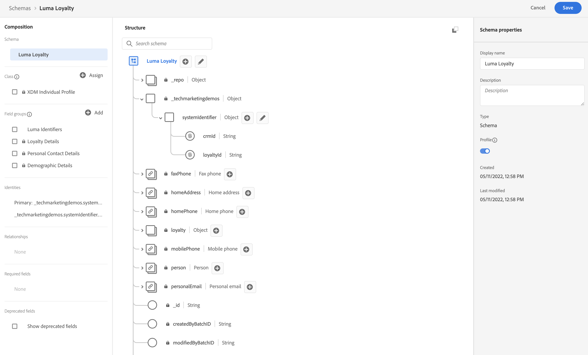

# Configuration manuelle des données

Dans cette section, vous créez les espaces de noms d’identité requis et définissez les [!DNL Luma] exemple de structure de données en créant la variable [[!UICONTROL schémas]](https://experienceleague.adobe.com/docs/experience-platform/xdm/schema/composition.html?lang=fr).

>[!TIP]
>Regardez le tutoriel vidéo [Mappage des identités](/help/set-up-data/map-identities.md) avant de commencer.

## Étape 1 : Création d’espaces de noms d’identité

Au cours de cette étape, vous créez des espaces de noms d’identité pour le [!DNL Luma] champs d’identité personnalisés nommés `lumaLoyaltyId`, `lumaCrmId`, et `lumaProductSKU`. Les espaces de noms d’identité jouent un rôle essentiel dans la création de profils clients en temps réel, car deux valeurs correspondantes dans le même espace de noms permettent à deux sources de données de former un graphique d’identités.

Commencez par créer un [!UICONTROL namespace] pour le [!DNL Luma Loyalty ID] schema :

1. Dans l’interface utilisateur de Journey Optimizer, accédez à ***[!UICONTROL Client]** > **[!UICONTROL Identités]** dans le volet de navigation de gauche.

1. Sélectionner **[!UICONTROL Créer un espace de noms d’identité]**.

1. Indiquez les informations suivantes :

   | Nom d’affichage | Symbole d’identité | Type |
   |---|---|---|
   | `Luma Loyalty ID` | `lumaLoyaltyId` | [!UICONTROL Identifiant multi-appareils] |

1. Sélectionnez **[!UICONTROL Créer]**.

   

1. Créez deux espaces de noms supplémentaires en procédant de la même manière :

   | Nom d’affichage | Symbole d’identité | Type |
   |---|---|---|
   | `Luma CRM ID` | `lumaCrmId` | [!UICONTROL Identifiant multi-appareils] |
   | `Luma Product SKU` | `lumaProductSKU` | [!UICONTROL Identifiant de non-personne] |

## Étape 2 : Création de schémas

Au cours de cette étape, vous définissez la structure des données d’exemple en créant six [[!UICONTROL schémas]](https://experienceleague.adobe.com/docs/experience-platform/xdm/schema/composition.html):

* [[!DNL Luma Loyalty Schema]](#create-luma-loyalty-schema)

* [[!DNL Luma Product catalog Schema]](-catalog)

* [[!DNL Luma Product Inventory Events]](#create-luma-product-inventory-event-schema)

* [[!DNL Luma CRM]](#create-luma-crm-and-luma-product-interactions-schemas)

* [[!DNL Luma Product Interactions]](#create-luma-crm-and-luma-product-interactions-schemas)

* [[!DNL Luma Test Profiles]](#create-luma-crm-and-luma-product-interactions-schemas)

>[!TIP]
>
>Regardez le tutoriel vidéo : [Création d’un schéma](/help/set-up-data/create-schema.md) avant de commencer.

### Créer [!DNL Luma Loyalty] [!UICONTROL Schéma] {#create-luma-loyalty-schema}

#### Création du schéma

Commencez par créer le [!DNL Luma Loyalty] schema :

1. Accédez à **[!UICONTROL GESTION DES DONNÉES]** > **[!UICONTROL Schémas]** dans le volet de navigation de gauche.

1. Sélectionner **[!UICONTROL Création d’un schéma]** en haut à droite.

1. Dans le menu déroulant, sélectionnez **[!UICONTROL XDM Individual Profile]**, puisque vous modélisez les attributs d’un client individuel (points, état, etc.).

   

#### Ajouter des groupes de champs existants

Vous êtes ensuite invité à ajouter des groupes de champs au schéma. Vous devez ajouter tous les champs aux schémas à l’aide de groupes. Vous ajoutez des groupes de champs existants et vous devez en créer un.

>[!NOTE]
>
>Si la variable [!UICONTROL Groupes de champs] modal ne s’ouvre pas automatiquement sur le [!UICONTROL Schémas] page, sélectionnez **[!UICONTROL Ajouter]** (comme illustré ci-dessous).

1. Sur le **[!UICONTROL Ajouter des groupes de champs]** , activez les groupes de champs suivants :

   * **[!UICONTROL Détails démographiques]** pour les données client de base telles que le nom et la date de naissance.

   * **[!UICONTROL Détails du contact personnel]** pour les détails de contact de base, tels que l’adresse électronique et le numéro de téléphone.

   * **[!UICONTROL Détails de fidélité]** pour les détails de fidélité, tels que les points, la date de jointure ou l’état. Le groupe de champs de fidélité est très bas dans la liste. Il est donc plus facile de le rechercher.

1. Sélectionner **[!UICONTROL Ajouter un groupe de champs]** pour ajouter les trois groupes de champs au schéma.

   

1. Sélectionnez le noeud supérieur du schéma.

1. Entrée `Luma Loyalty Schema` comme la propriété [!UICONTROL Nom d’affichage].

#### Créez un [!UICONTROL groupe de champs]

Pour garantir la cohérence entre les schémas, Adobe recommande de gérer tous les identifiants système dans un seul groupe :

1. Dans la **[!UICONTROL Composition]** sous [!UICONTROL Groupes de champs], sélectionnez **[!UICONTROL Ajouter]**.

1. Sélectionner **[!UICONTROL Créer un groupe de champs]**.

1. Ajouter `Luma Identity Profile Field Group` comme la propriété **[!UICONTROL Nom d’affichage]**.

1. Ajouter `system identifiers for XDM Individual Profile class` comme la propriété **[!UICONTROL Description]**.

1. Sélectionner **[!UICONTROL Ajouter des groupes de champs]**.

   

#### Ajouter des champs au nouveau [!UICONTROL groupe de champs]

Le nouveau groupe de champs vide est ajouté à votre schéma. Les boutons + vous permettent d’ajouter de nouveaux champs à n’importe quel emplacement de la hiérarchie. Dans ce cas, vous devez ajouter des champs au niveau racine :

1. Sélectionner **[!UICONTROL +]** en regard du nom du schéma.

   Cette étape permet d’ajouter un champ sous **votre identifiant de tenant** pour gérer les conflits entre vos champs personnalisés et tous les champs standard.

1. Dans le **[!UICONTROL Propriétés du champ]** dans la barre latérale, ajoutez les détails du nouveau champ :

   * **Nom du champ:** `systemIdentifier`

   * **[!UICONTROL Nom d’affichage]:** `System Identifier`

   * **Type :** Objet

   * **[!UICONTROL Attribuer un groupe de champs]:** [!DNL Luma identifiers]

1. Sélectionner **[!UICONTROL Appliquer]**.

   

   Ajoutez deux champs sous le `systemIdentifier` objet :

   | [!UICONTROL Fieldname] | [!UICONTROL Nom d’affichage] | [!UICONTROL Type] |
   |-------------|-----------|----------|
   | `loyaltyId` | `Loyalty ID` | [!UICONTROL Chaîne] |
   | `crmId` | `CRM Id` | [!UICONTROL Chaîne] |

#### Définition des identités

Vous disposez désormais de la variable [!UICONTROL namespace] et le [!DNL Luma Loyalty schema] configuré. Avant d’ingérer des données, vous devez libeller les champs d’identité. Chaque schéma utilisé avec [!UICONTROL Real-time Customer Profile] est requis pour qu’une identité Principale soit spécifiée et chaque enregistrement ingéré doit avoir une valeur pour ce champ.

1. Définissez la variable **Principale identité**:

   Dans la **[!DNL Luma Loyalty Schema]**:

   1. Sélectionnez la **[!DNL Luma Identity Profile Field Group]**.

   2. Sélectionnez la **[!DNL loyaltyId]** champ .

   3. Dans le **[!UICONTROL Propriétés du champ]**, activez la variable **[!UICONTROL Identité]** de la boîte.

   4. Activez la variable **[!UICONTROL Identité Principal]** de la boîte.

   5. Sélectionnez la `Luma Loyalty Id` namespace de **[!UICONTROL Espaces de noms d’identité]** menu déroulant.

   6. Sélectionner **[!UICONTROL Appliquer]**.

      

2. Définir une **identité secondaire**:

   Dans la **[!DNL Luma Loyalty Schema]**:

   1. Sélectionnez la **[!DNL Luma Identity Profile Field Group]**.

   2. Sélectionnez la `crmId` champ .

   3. Dans le **[!UICONTROL Propriétés du champ]**, activez la variable **[!UICONTROL Identité]** de la boîte.

   4. Sélectionnez la `Luma CRM Id` namespace de **[!UICONTROL Espaces de noms d’identité]** menu déroulant.

   5. Sélectionner **[!UICONTROL Appliquer]**.

#### Activation pour le profil et enregistrement du schéma

1. Sélectionnez le noeud supérieur du schéma.

1. Dans le [!UICONTROL Propriétés du champ] enable **[!UICONTROL Profil]**.

   Le schéma doit se présenter comme suit :

   

1. Sélectionnez **[!UICONTROL Enregistrer]**.

### Créer [!DNL Luma Product catalog Schema] {#create-luma-product-catalog-schema}

1. Accédez à [!UICONTROL GESTION DES DONNÉES] -> **[!UICONTROL Schémas]** dans le volet de navigation de gauche.

1. Sélectionnez la **[!UICONTROL Création d’un schéma]** en haut à droite.

1. Dans le menu déroulant, sélectionnez **[!UICONTROL Parcourir tous les types de schéma]**, qui vous permet de créer une classe.

1. Sélectionner **[!UICONTROL Création d’une classe].

1. Ajoutez le nom d’affichage : `Luma Product Catalog Class`.

1. Attribuez une classe.

1. Créez un [!UICONTROL groupe de champs]:

   * Nom d’affichage: `Luma Product Catalog Field Group`

2. Ajoutez le champ suivant au **[!DNL Luma Product Catalog Field Group]**.

   * Nom du champ: `product`

   * Nom d’affichage: `Product`

   * Type : [!UICONTROL Objet]

   * Groupe de champs: [!DNL Luma Product Catalog Field Group]

3. Sélectionner **[!UICONTROL Appliquer]**.

4. Ajoutez les champs suivants au **[!DNL Product]** objet :

   | [!UICONTROL Fieldname] | [!UICONTROL Nom d’affichage] | [!UICONTROL Type] |
   |-------------|-----------|----------|
   | `sku` | `SKU` | [!UICONTROL Chaîne] |
   | `name` | `Name` | [!UICONTROL Chaîne] |
   | `category` | `Category` | [!UICONTROL Chaîne] |
   | `color` | `Color` | [!UICONTROL Chaîne] |
   | `size` | `Size` | [!UICONTROL Chaîne] |
   | `price` | `Price` | [!UICONTROL Double] |
   | `description` | `Description` | [!UICONTROL Chaîne] |
   | `ImageURL` | `Image URL` | [!UICONTROL Chaîne] |
   | `stockQuantity` | `Stock Quantity` | [!UICONTROL Chaîne] |

5. Ajoutez la variable **[!UICONTROL Nom d’affichage]** `Luma Product Catalog Field Group` au [!UICONTROL groupe de champs].

6. Sélectionnez **[!UICONTROL Enregistrer]**.

### Créer [!DNL Luma Product Inventory Event Schema] {#create-luma-product-inventory-event-schema}

1. Accédez à **[!UICONTROL GESTION DES DONNÉES]** -> **[!UICONTROL Schémas]** dans le volet de navigation de gauche.

1. Sélectionnez la **[!UICONTROL Création d’un schéma]** en haut à droite.

1. Dans le menu déroulant, sélectionnez **[!UICONTROL Parcourir tous les types de schéma]**.

1. Sélectionner **[!UICONTROL Création d’une classe]**.

1. Ajoutez le nom d’affichage : `Luma Business Event`.

1. Sélectionnez le type : *[!UICONTROL Série temporelle]*.

1. Attribuez une classe.

1. Créez un [!UICONTROL groupe de champs]:

   * Nom d’affichage: `Product Inventory Event Details`

1. Ajoutez la variable **[!UICONTROL Nom d’affichage]** `Luma Product Inventory Event Schema` au schéma.

1. Ajoutez le champ suivant au groupe de champs Informations sur le produit Luma :

   * Nom du champ: `inventoryEvent`

   * Nom d’affichage: `Inventory Event`

   * Type : [!UICONTROL Objet]

   * Groupe de champs: [!DNL Product Inventory Event Details]

1. Ajoutez les champs suivants au **[!DNL Product Inventory Event Details]** objet :

   | [!UICONTROL Fieldname] | [!UICONTROL Nom d’affichage] | [!UICONTROL Type] |
   |-------------|-----------|----------|
   | `productId` | `Product ID` | [!UICONTROL Chaîne] |
   | `sku` | `SKU` | [!UICONTROL Chaîne] |
   | `stockEventType` | `Stock Event Type` | **[!UICONTROL Enum]** avec `restock` et `outOfStock` as values |

   1. pour définir la variable `stockEventType` pour Enum, sélectionnez type : `string`.

   1. Faites défiler la page vers le bas de la page **[!UICONTROL Propriétés du champ]**.

   1. Activer **[!UICONTROL Enum]**.

   1. Entrée **[!UICONTROL values] ([!UICONTROL label)]**: `restock` (`restock`).

   1. Sélectionner **[!UICONTROL Ajouter une ligne]**.

   1. Entrée **[!UICONTROL values] ([!UICONTROL label)]**: `outOfStock` (`out of stock`).

   1. Sélectionner **[!UICONTROL Appliquer]**.

      

1. Définir `productId` champ comme **[!UICONTROL Principale identité]** using **[!DNL Luma Product namespace]**.

1. Sélectionnez la `sku` et définir une relation avec la propriété `product.sku` dans le champ **[!DNL Luma Product catalog Schema]** Schéma :

   1. Faites défiler la page vers le bas de la page **[!UICONTROL Propriétés du champ]**.

   1. Activer **[!UICONTROL Relation]**.

      1. **[!UICONTROL Schéma de référence]**: [!DNL Luma Product catalog Schema].

      1. **[!UICONTROL Espace de noms d’identité de référence]**: [!DNL Luma Product].
   1. Sélectionner **[!UICONTROL Appliquer]**.

      Le schéma doit se présenter comme suit :

      

1. Activer pour **Profil**.

1. Sélectionner [!UICONTROL Enregistrer] pour enregistrer le schéma.

### Créez le [!DNL Luma CRM] et [!DNL Luma Product Interactions] schémas {#create-luma-crm-and-luma-product-interactions-schemas}

Créez les [!UICONTROL schémas]:

| [!UICONTROL Nom d’affichage] | [!DNL Luma CRM] | [!DNL Luma Product Interactions] | [!DNL Luma Test Profiles] |
|  ---| ------- | ---- |----|
| **[!UICONTROL Type]** | [!UICONTROL XDM Individual Profile] | [!UICONTROL Événement d’expérience XDM] | [!UICONTROL XDM Individual Profile] |
| **[!UICONTROL Ajouter un groupe de champs existant]** | Identifiants Luma Détails démographiques Détails du contact personnel | Mappage d’identités Détails du commerce | Identifiants Luma Détails démographiques Détails du contact personnel Détails du test de profil |
| **[!UICONTROL Relation]** |  | *[!DNL productListItems.SKU]*:  Schéma de référence *[!DNL Luma Product catalog Schema]*  [!DNL Reference identity namespace] *[!DNL Luma Product]* schema |
| **[!UICONTROL Identité Principal] [!UICONTROL namespace])** | systemIdentifier.crmId (Identifiant Luma CRM) |  | personalEmail.address (Email) |
| **[!UICONTROL Identité Secondaire] [!UICONTROL namespace]** | personalEmail.address (Email) mobilePhone.number (Phone) |  |
| **[!UICONTROL Activer pour le profil]** | oui | oui | oui |

## Étapes suivantes

Maintenant que vous avez créé la structure de données, vous [créer des jeux de données et ingérer des exemples de données ;](/help/tutorial-configure-a-training-sandbox/manual-data-ingestion.md).
