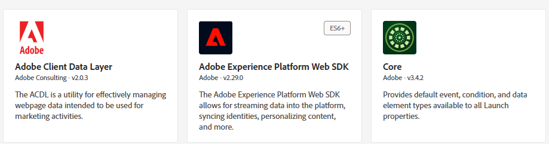

# Création de balises Adobe Experience Platform

Les balises Adobe Experience Platform (anciennement Adobe Launch) permettent de gérer et de déployer* des technologies de marketing et d’analyse sur votre site web sans avoir à modifier le code du site.

Cette [ vidéo décrit le processus de création d’Adobe Experience Tags](https://experienceleague.adobe.com/fr/playlists/experience-platform-get-started-with-tags)

* Connexion à la collecte de données
* Cliquez sur Balises -> Nouvelle propriété .
* Créez une balise Adobe Experience Platform appelée Conseils financiers.

* Ajoutez les extensions suivantes à la balise .
  

* Veillez à configurer le SDK Web Adobe Experience Platform pour utiliser l&#39;environnement approprié et le flux de données Financial Advisors créé à l&#39;étape précédente.
  

* Aucune configuration supplémentaire n’est nécessaire pour les extensions Core et de la couche de données client Adobe

## Création d’éléments de données

Les éléments de données sont utilisés pour collecter, organiser et diffuser des données sur les technologies publicitaires et marketing web.

Créez les éléments de données suivants

| Nom de l’élément | Extension | Type d’élément de données | Commentaires supplémentaires |
|------------------------------|-----------------------------------|-------------------|------------------------------------------------------------------------------------------------------------------------------------------------------------------|
| Instrument Financier Préféré | Base | Custom code | Voir la note ci-dessous |
| Objet XDM | SDK Web Adobe Experience Platform | Objet XDM | Sélectionnez votre environnement et votre schéma de conseillers financiers |


Pour le code personnalisé, ouvrez l’éditeur de code, puis copiez et collez le code suivant

```javascript
return window.adobeDataLayer
  ?.slice()
  .reverse()
  .find(event => event.event === "assetClassSelection")
  ?.xdm?.FinancialInterest?.PreferredFinancialInstrument || "undefined";
```

## Explication du code

Examinez le tableau adobeDataLayer (qui stocke les événements se produisant sur votre page web).

Effectuez une copie du tableau à l’aide de.slice() afin que l’original ne soit pas modifié.

Inversez l’ordre des événements pour vérifier d’abord les événements les plus récents.

Recherchez le premier événement (à partir du plus récent) où event.event est exactement « assetClassSelection ».

S’il est trouvé, accédez aux données xdm de cet événement et obtenez la valeur de FinancialInterest.PreferredFinancialInstrument.

Si rien n’est trouvé, renvoyez la chaîne « undefined »,


## Créer une règle

Le Créateur de règles dans Adobe Experience Platform Tags vous permet de définir quand et comment des actions spécifiques doivent s’exécuter sur votre site web en fonction du comportement des utilisateurs ou des événements.

* Créez une règle appelée Envoyer l’instrument financier préféré. Cette règle contient un événement et une action


* Créez une configuration d’événement nommée Classe de ressources préférée sélectionnée comme illustré ci-dessous. Cet événement écoute les événements assetClassSelection.
  


* Création d’une action pour envoyer le schéma XDM mis à jour à AEP
  

* Votre règle finale doit se présenter comme suit :
  

## Création et déploiement d’AEP Tags


Créez une bibliothèque et ajoutez-y toutes les ressources modifiées, comme illustré dans les captures d’écran ci-dessous.

Ajouter une bibliothèque


créer une bibliothèque ;

Dans l’écran Créer une bibliothèque , spécifiez le nom de la bibliothèque et l’environnement.
Vous devez ajouter toutes les ressources modifiées à cette bibliothèque


Cliquez ensuite sur le bouton Enregistrer et créer dans le développement pour créer la bibliothèque

## Inclure les balises AEP dans la page HTML

Lorsque vous publiez une propriété AEP Tags, Adobe vous fournit une balise de script que vous devez placer dans votre ``` <head>``` HTML ou au bas des balises ``` <body>```.

* Accédez à la propriété Balises (conseillers financiers).

* Cliquez sur Environnements et cliquez sur l’icône d’installation de l’environnement souhaité (par exemple, Développement, Évaluation, Production).

* Notez le code incorporé. Vous en aurez besoin à un stade ultérieur de ce tutoriel.
