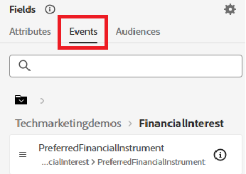
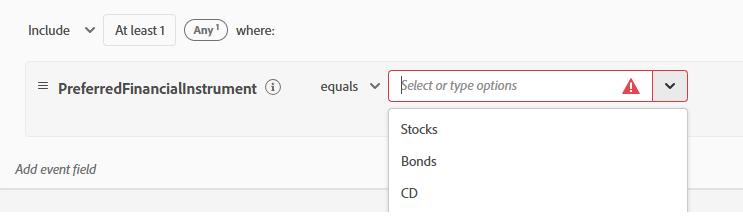
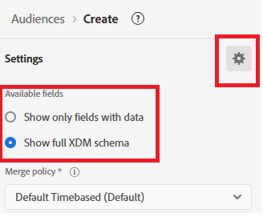

# Création d’audiences dans Adobe Journey Optimizer

Dans Adobe Experience Platform, les audiences sont des groupes d’utilisateurs créés en fonction de leurs actions, préférences ou informations de profil, afin de proposer des expériences personnalisées.

* Connexion à Journey Optimizer
* Accédez à Client -> Audiences ->Créer une audience
* Création d’audiences à l’aide de la méthode Créer une règle

  

* Créez les 3 audiences suivantes

  * Clients intéressés par les actions

  * Clients intéressés par les obligations

  * Clients intéressés par le CD

* Assurez-vous que la méthode d’évaluation de chaque audience est définie sur _****_ pour la qualification en temps réel.
  

* Utilisez le champ Instrument financier préféré pour segmenter les utilisateurs en fonction de leur intérêt d’investissement sélectionné, tel que Actions, Obligations ou CD

>[!NOTE]
>
>>Si le champ PreferredFinancialInstrument n’est pas visible dans l’onglet Événements, cliquez sur l’icône des paramètres et activez/désactivez l’option Afficher l’ensemble du schéma XDM.

