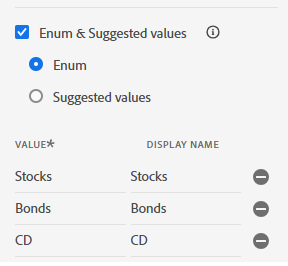

# Configurer un schéma, un jeu de données et un flux de données XDM dans AEP

## Créer un schéma XDM

* Connexion à Adobe Experience Platform
* Gestion des données -> Schémas -> Créer un schéma

* Créez un schéma basé sur un événement XDM appelé _conseillers financiers_. Si vous ne connaissez pas la création d’un schéma, consultez cette [documentation](https://experienceleague.adobe.com/en/docs/experience-platform/xdm/tutorials/create-schema-ui)

* Ajoutez la structure suivante à votre schéma. L’élément PreferredFinancialInstrument stocke la préférence de l’utilisateur ou de l’utilisatrice pour les actions, les obligations et les CD. Le **__techmarketingdemos_**est l’identifiant du client et sera différent dans votre environnement.
  

* L’élément PreferredFinancialInstrument possède des valeurs d’énumération définies comme illustré ci-dessous
  

* Assurez-vous que le schéma est activé pour le profil.

## Création d’un jeu de données basé sur le schéma

Un **jeu de données dans Adobe Experience Platform (AEP)** est un conteneur de stockage structuré utilisé pour ingérer, stocker et activer des données en fonction d’un schéma XDM défini.

* Gestion des données -> Jeux de données -> Créer un jeu de données
* Créez un jeu de données appelé _Jeu de données des conseillers financiers_ basé sur le schéma XDM (conseillers financiers) créé à l’étape précédente.

* Vérifiez que le jeu de données est activé pour le profil

## Créer un flux de données

Un flux de données dans Adobe Experience Platform est comme un pipeline (ou une autoroute) sécurisé qui connecte votre site web ou votre application aux services Adobe, permettant aux données d’entrer et au contenu personnalisé de revenir.

* Collecte de données > Flux de données, puis cliquez sur Nouveau flux de données. Nommez le flux de données _flux de données des conseillers financiers_

* Fournissez les détails suivants, comme illustré dans la capture d’écran ci-dessous.
  
* Cliquez sur Enregistrer , puis sur Ajouter un mappage et ajoutez le service Adobe Experience Platform et le jeu de données d’événement, comme illustré ci-dessous
  

* Sélectionnez le jeu de données d’événement approprié (créé précédemment).

* Enregistrer le flux de données

