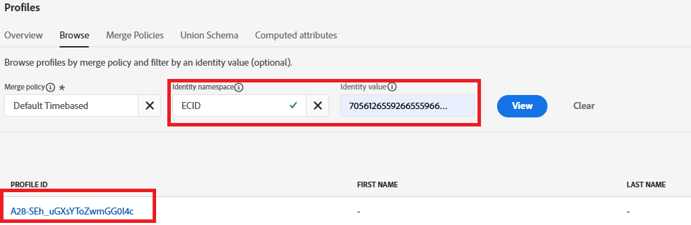

# Test de la solution

Pour valider votre implémentation, commencez par ouvrir la page web contenant votre formulaire de préférence. Utilisez les outils de développement du navigateur (onglets Console et Réseau) pour surveiller le processus d’envoi du formulaire. Après avoir envoyé une préférence (par exemple, en sélectionnant « Stocks »), vérifiez que le SDK Web AEP (alloy.sendEvent) se déclenche correctement et que les données correctes sont envoyées à Adobe Experience Platform. Dans AEP, accédez à la section Audiences et vérifiez que votre profil se qualifie pour l’audience prévue (par exemple, « Intéressé par les actions ») en quelques instants, à l’aide de la segmentation Edge. Vous pouvez également examiner les données d’événement entrantes dans le jeu de données associé pour vous assurer qu’elles contiennent la valeur de préférence correcte. Répétez ce processus pour chaque classe d’actifs (actions, obligations, CD) afin de vous assurer que l’ensemble du workflow fonctionne correctement.

## Conseils de dépannage

Si vous ne voyez pas immédiatement le profil éligible pour l’audience prévue, vérifiez les points suivants :

### Valider la notification push de la couche de données Adobe

* Ouvrez la Developer Tools → Console du navigateur
* Type console.log(window.adobeDataLayer);
* Vérifiez qu’un événement avec l’événement : « assetClassSelection » et la valeur correcte de PreferredFinancialInstrument s’affiche après l’envoi du formulaire

### Confirmer l’exécution de la règle Launch

* Ouvrez l’Adobe Experience Platform Debugger (extension Chrome)
* Se connecter au débogueur
* Envoyer le formulaire
* Vérifiez que l’événement DataPushed pour assetClassSelection est capturé.

La capture d’écran suivante du débogueur devrait vous aider

### Obtenir l’ECID

L’ECID (Experience Cloud ID) est un identifiant persistant unique d’Adobe utilisé pour reconnaître et unifier les utilisateurs dans les solutions et sessions Experience Cloud.

* Onglet Réseau → Outils de développement Chrome

* Filtrer par « interaction » ou « collecte »

* Envoyer le formulaire
* Cliquez sur l’onglet Réponse et notez l’ECID

### Vérifier la qualification du profil en temps réel et de l’audience

* Connexion à Journey Optimizer
* Accédez à Clients->Profils->Parcourir .
* Recherchez l’ECID obtenu à l’étape précédente, comme illustré dans la capture d’écran
  
* Cliquez sur le profil et sélectionnez l’onglet Événements pour vérifier si investment_preference_event est répertorié
  
* Ouvrez le fichier json associé à l’événement et vérifiez s’il contient les données d’événement correctes.

### Autres conseils de dépannage

* Assurez-vous que le schéma et le profil du jeu de données sont activés.
* Assurez-vous que la segmentation Edge est activée pour l’audience afin que la qualification se produise en temps quasi réel.
* Il peut également être utile d’attendre quelques minutes et d’actualiser la vue Audiences , en particulier si le test a lieu juste après la publication des modifications.
* Assurez-vous que les règles d’audience sont correctement définies et référencez les noms et valeurs exacts des champs capturés à partir de l’envoi du formulaire.
