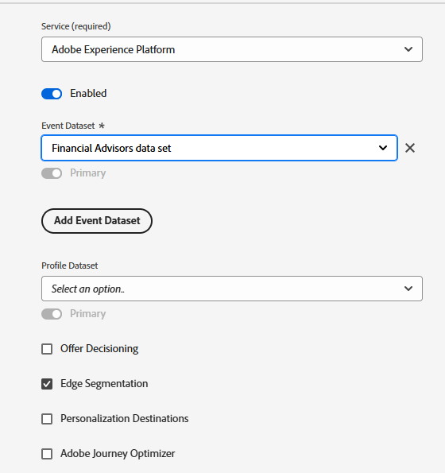

# Configurer des schémas, des jeux de données, des flux de données et des audiences XDM dans AEP

* Connexion à Adobe Experience Platform

* Création d’un schéma basé sur un événement XDM appelé Conseils financiers dans Journey Optimizer. Si vous ne connaissez pas la création d’un schéma, consultez cette [documentation](https://experienceleague.adobe.com/fr/docs/experience-platform/xdm/tutorials/create-schema-ui)

* Ajoutez la structure suivante à votre schéma. L’élément PreferredFinancialInstrument stocke la préférence de l’utilisateur pour les actions, les obligations et les CD
  

* L’élément PreferredFinancialInstrument possède des valeurs d’énumération définies comme illustré ci-dessous
  

* Assurez-vous que le schéma est activé pour le profil.

## Création d’un jeu de données basé sur le schéma

Un **jeu de données dans Adobe Experience Platform (AEP)** est un conteneur de stockage structuré utilisé pour ingérer, stocker et activer des données en fonction d’un schéma XDM défini.

* Créez un jeu de données appelé _Jeu de données des conseillers financiers_ basé sur le schéma XDM (conseillers financiers) créé à l’étape précédente.

* Vérifiez que le jeu de données est activé pour le profil

## Créer un flux de données

Un flux de données dans Adobe Experience Platform est comme un pipeline (ou une autoroute) sécurisé qui connecte votre site web ou votre application aux services Adobe, permettant aux données d’entrer et au contenu personnalisé de revenir.

* Accédez à AEP > Flux de données, puis cliquez sur Nouveau flux de données. Nommez le flux de données _flux de données des conseillers financiers_

* Fournissez les détails suivants, comme illustré dans la capture d’écran ci-dessous.
  
* Cliquez sur Enregistrer , puis sur Ajouter un mappage et ajoutez le service Adobe Experience Platform et le jeu de données d’événement, comme illustré ci-dessous
  

* Sélectionnez le jeu de données d’événement approprié (créé précédemment).

* Enregistrer le flux de données

## Création d’audiences

Dans Adobe Experience Platform, les audiences sont des groupes d’utilisateurs créés en fonction de leurs actions, préférences ou informations de profil, afin de proposer des expériences personnalisées.

* Accédez à Client -> Audiences
* Création d’audiences à l’aide de la méthode Créer une règle

* Créez les 3 audiences suivantes dans AJO à l’aide de l’élément PreferredFinancialInstrument du schéma d’événement.

   * Clients intéressés par les actions

   * Clients intéressés par les obligations

   * Clients intéressés par le CD

Assurez-vous que la méthode d’évaluation de chaque audience est définie sur Edge pour la qualification en temps réel.

Les captures d’écran suivantes doivent vous aider à créer les audiences.

