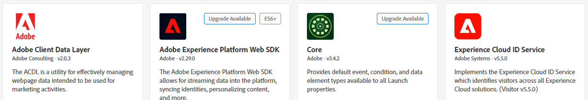
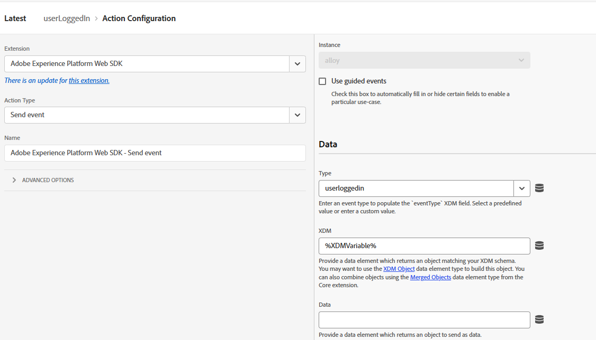

# Envoyer le CRMID à Adobe Experience Platform

Adobe Experience Platform Tags est utilisé pour envoyer le CRMID à Adobe Experience Platform (AEP), car il fournit un mécanisme flexible piloté par les événements pour transmettre des données d’identité directement depuis le navigateur. L’envoi d’un CRMID après la connexion de l’utilisateur permet à AEP de lier l’ECID anonyme au profil CRM connu, ce qui permet un regroupement précis des identités. Ce lien constitue la base de la création de profils clients unifiés, de la qualification des audiences et de la diffusion d’expériences personnalisées en temps réel dans Adobe Journey Optimizer (AJO).

Une propriété Experience Platform Tags appelée _**FinWise**_ est créée. Les extensions suivantes ont été ajoutées à la propriété Tags

Configurez l’extension AEP Web SDK à l’aide du flux de données Financial Advisors créé à l’étape précédente.
Le service Experience Cloud ID est une extension facultative ajoutée à la propriété de balise à des fins de débogage.

## Balisage des éléments de données

Créez les éléments de données suivants

| Élément de données | Extension | Type d’élément de données | Paramètres personnalisés |
|--------------|-----------------------------------|---------------------------|----------------------------------------|
| crmid | Couche de données client Adobe | État calculé de la couche de données | user.crmid |
| ECID | Service Experience Cloud ID | ECID |                                        |
| une identité | SDK Web Adobe Experience Platform | Mappage d’identités |  |
| Variable XDM | SDK Web Adobe Experience Platform | Variable |  |

## Créer une règle

Créez une règle appelée userLogin avec l’événement et les actions suivants :

Événement

Action Mettre à jour la variable

Action Envoyer l’événement

## Enregistrer et créer

Enregistrez vos modifications, créez et créez la bibliothèque.
