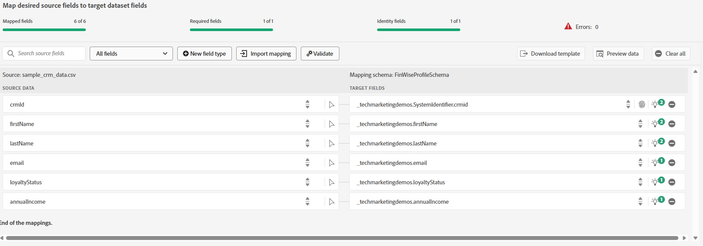

# Importer des exemples de données CRM dans un jeu de données de profil AEP

Pour commencer la combinaison d’identités, importez des exemples de données de profil CRM dans un jeu de données lié à un schéma activé pour les profils dans Adobe Experience Platform

## Création d’un espace de noms personnalisé

* Accédez à Client -> Identités -> Créer un espace de noms d’identité.
* Sélectionnez Identifiant individuel sur l’ensemble des appareils et indiquez le nom d’affichage et le symbole d’identité, comme illustré dans la capture d’écran ci-dessous.
  

## Création d’un schéma activé pour le profil

Créez un schéma de profil individuel appelé **_FinWiseProfileSchema_**. Incluez des champs tels que annualIncome, email, firstName, lastName et loyaltyStatus.
Ajoutez un champ d&#39;identité **_crmid_** comme illustré. Marquez le champ crmid comme identité et principal.

## Préparation des données d’exemple

Mettez à jour les adresses e-mail factices vers des adresses réelles. Ils seront utilisés ultérieurement lors de l’envoi de messages avec Adobe Journey Optimizer.

|   | crmId | Prénom | Nom | e-mail | loyaltyStatus | zipCode | annualIncome |
|---|--------|-----------|----------|-------------------------|---------------|---------|--------------|
|   | FIN001 | Alice | Wong | alice.wong@example.com | Gold | 92128 | 120000 |
|   | FIN002 | Bob | Smith | bob.smith@example.com | Argent | 92126 | 85000 |
|   | FIN003 | Charlie | Kim | charlie.kim@example.com | Platine | 60614 | 175000 |
|   | FIN004 | Diana | Lee | diana.lee@example.com | Gold | 30303 | 98000 |
|   | FIN005 | Ethan | Marron | ethan.brown@example.com | Bronze | 75201 | 60000 |

## Ingestion du fichier CSV

* Créez un jeu de données appelé **_FinWiseCustomerDataSetWithAnnualIncome_** basé sur le **_FinWiseProfileSchema_** créé dans l’exemple précédent. Assurez-vous que le jeu de données est activé pour le profil.

* Accédez à Connexions -> Sources -> Système local
* Sélectionnez l’option **_Ajouter des données_** sous Chargement de fichier local. Veillez à sélectionner le _&#x200B;**FinWiseCustomerDataSetWithAnnualIncome**&#x200B;_ comme jeu de données cible.
  
* Accédez à l’écran suivant. Chargez le [fichier csv](assets/finwise_profiles.csv) et vérifiez les mappages
  

* Cliquez sur Terminer pour lancer le processus d’ingestion des données

## Vérifier le profil

* Accédez à Client ->Profils et recherchez l’identifiant CRM FinWise égal à FIN001 ou toute autre valeur valide
  
