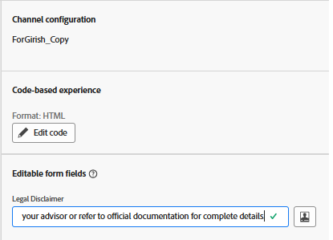

# Utilisation de champs de formulaire modifiables dans les expériences basées sur du code AJO

Dans de nombreux parcours marketing, en particulier dans les industries réglementées, il est essentiel d&#39;inclure une clause de non-responsabilité qui peut varier en fonction de la campagne, de la zone géographique ou du produit. En utilisant un [champ modifiable](https://experienceleague.adobe.com/en/docs/journey-optimizer-learn/tutorials/channels/code-based-experience-channel/form-fields-in-code-based-experiences) directement dans l’éditeur Personalization d’AJO, les spécialistes marketing et les équipes juridiques peuvent conserver un contrôle total sur le texte de clause de non-responsabilité sans impliquer les développeurs ni modifier la logique de décision.

Cela permet des mises à jour rapides et garantit la conformité entre les campagnes tout en exploitant le contenu décisionnel tel que les offres.

## Insérer un champ modifiable dans l’éditeur de personnalisation

- Ouvrez la campagne créée à l’étape précédente.
- Cliquez sur _&#x200B;**Modifier la campagne**&#x200B;_
- Accédez à l’onglet _&#x200B;**Contenu**&#x200B;_
- Cliquez sur _&#x200B;**Modifier le code**&#x200B;_ et insérez un champ modifiable appelé legalDisclaimer avec une valeur par défaut en utilisant la syntaxe suivante dans l’éditeur de personnalisation

- `{{#inline "legalDisclaimer" name="Legal Disclaimer"}} Legal Disclaimer will go here {{/inline}}`

- Utilisez la variable `{{{legalDisclaimer}}}` dans le modèle, comme illustré ci-dessous

- 

- Les marketeurs peuvent facilement modifier le champ Clause de non-responsabilité sans avoir à ouvrir l&#39;éditeur de personnalisation.
- 

## Publication de la campagne

Activez la campagne pour commencer à diffuser des offres personnalisées en temps réel.
