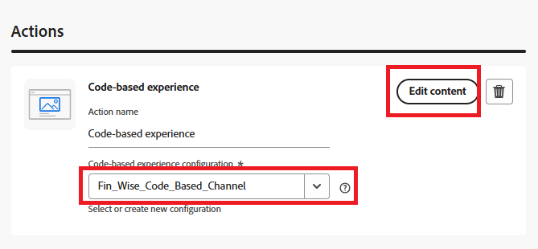

# Créer une campagne

Dans Adobe Journey Optimizer (AJO), une campagne fait office de conteneur regroupant tous les éléments nécessaires pour offrir des expériences personnalisées à une audience ciblée. Il orchestre le moment et la manière dont les offres sont présentées, en liant les composants tels que les canaux, les emplacements, les collections et les stratégies de décision.

1. Connectez-vous à Journey Optimizer.
1. Cliquez sur **[!UICONTROL Gestion des Parcours]** > **[!UICONTROL Campagnes]** > **[!UICONTROL Créer une campagne]** > **[!UICONTROL Planifier le marketing]**.
1. Sélectionnez l’action **[!UICONTROL Expérience basée sur du code]**, puis sélectionnez la configuration créée à l’étape précédente.
1. Cliquez sur **[!UICONTROL Modifier le contenu]**.

   

1. Pour ouvrir l’éditeur de personnalisation, cliquez sur **[!UICONTROL Modifier le code]**.

   

   L’éditeur de personnalisation est une interface de création d’expérience non visuelle qui vous permet de créer votre code.
