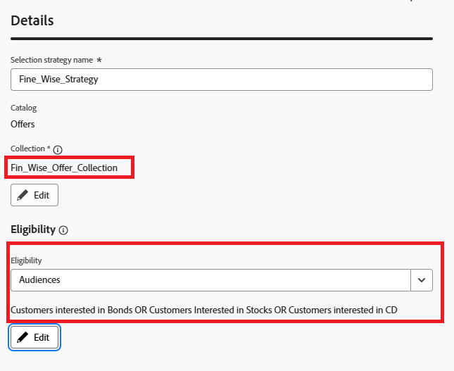

# Créer une stratégie de sélection

Une stratégie de sélection est une configuration réutilisable qui combine une collection d’offres avec des règles d’éligibilité et une méthode de classement afin de déterminer les offres à afficher lorsque la stratégie est utilisée dans une politique de décision.

Pour limiter la sélection des offres aux membres d’une audience Experience Platform, sélectionnez Audiences et choisissez une audience dans la liste. Pour ce tutoriel, les audiences créées dans le tutoriel précédent sont utilisées.

